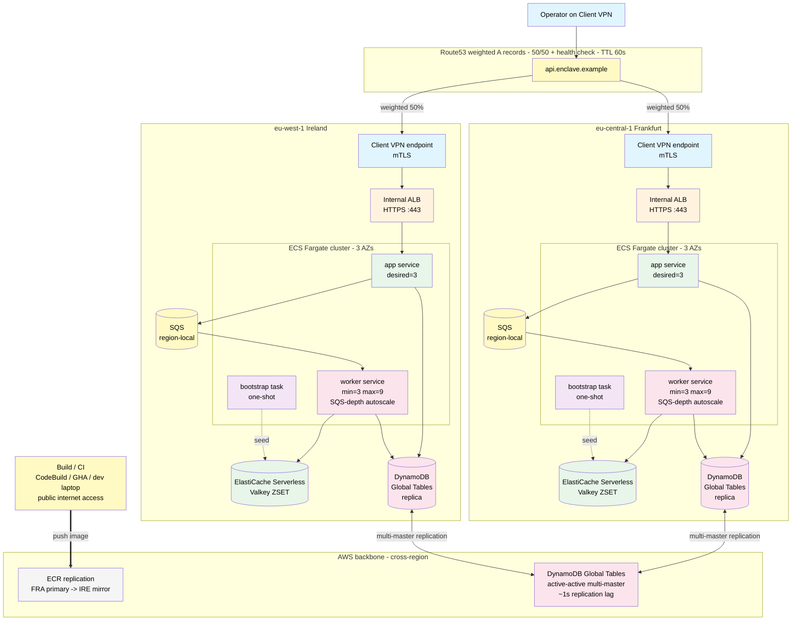
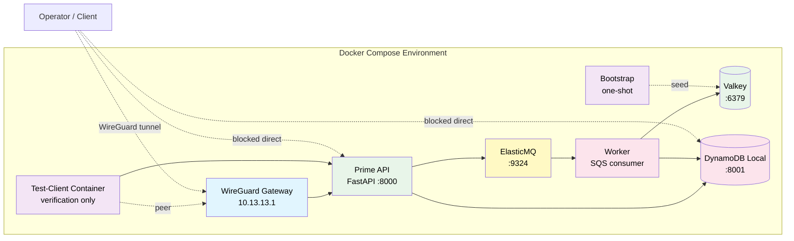
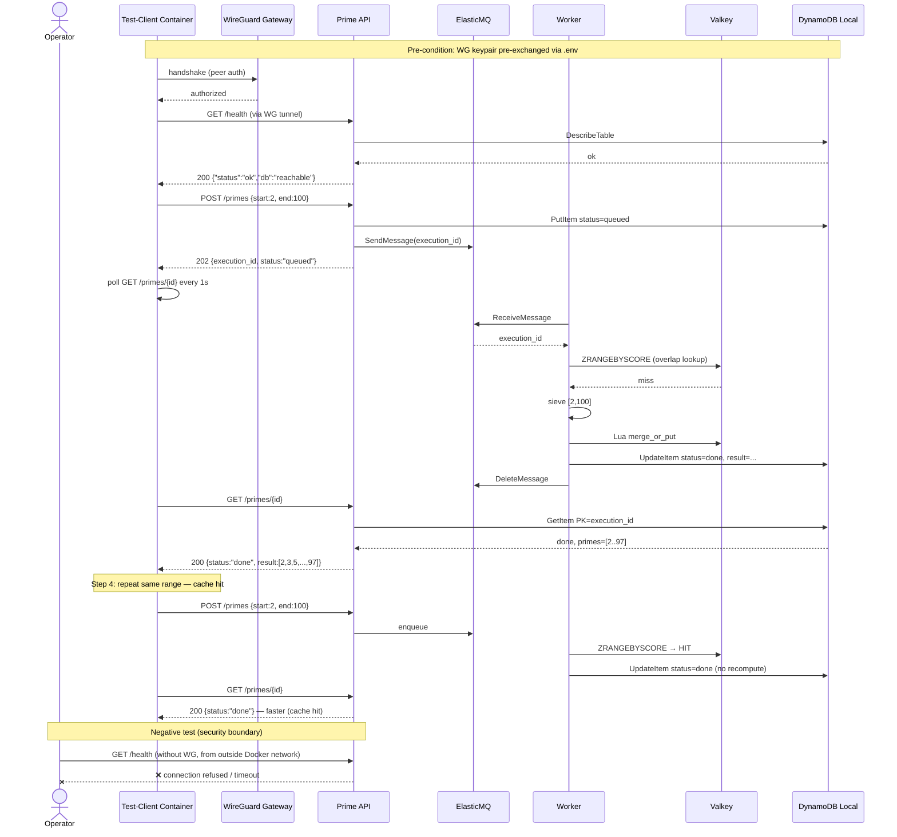

# aegis-enclave

> **Production-shape architecture at PoC scale.** A VPN-gated cloud microservice template with an agent-executable cross-cloud migration runbook. Part of the [`aegis-*`](https://binhsu.org) portfolio.

The repo is a runnable artifact, not a demo session. The smoke test in [§ Initial Acceptance](#initial-acceptance-smoke-test) lets a reviewer verify the security boundary in five commands without watching the author drive it.

---

## Service Specification

```
SERVICE: aegis-enclave prime computation service

INPUT CONTRACT:
  POST /primes        body: {start: int, end: int}
                       constraints: 2 <= start <= end <= 10^7
                       returns: 202 Accepted with execution_id

  GET /primes/{id}    returns: {status, primes[]} when done
                       polling-friendly; status ∈ {queued, running, done, failed}

  GET /health         returns: 200 OK

DEPLOYMENT SCOPE:
  Geographic pair:              eu-central-1 (Frankfurt) + eu-west-1 (Ireland), 50/50 active-active
  Data residency:               EU-jurisdictional (GDPR-clean; no SCC required for in-pair failover)
  Access pattern:               VPN-gated single-tenant (not public-facing SaaS)
  Region pair rationale:        ADR-0040 (selection criteria + rejected alternatives)
  Multi-region topology:        ADR-0042 (active-active 50/50 — multi-master rationale)

CAPACITY ENVELOPE (per region):
  Worker pool baseline:           3 (one per AZ; ADR-0007)
  Worker pool max:                9 (autoscale on SQS depth; ADR-0023)
  Per-request range cap:          10^7 (10,000,000)
  Per-task compute budget:        60s SIGALRM (ADR-0033)
  Acceptable p99 queue wait:      5 min (Tier 2 ops support; ADR-0008)
  Queue backpressure threshold:   5 × worker_count (ADR-0020)

SLO TARGETS (Tier 2 ops support per ADR-0008):
  RTO:                            15 min
  RPO:                            5 min
  p99 POST-to-202:                <100ms
  p99 poll-to-done worst case:    <6min (5min queue + 60s compute)
  Error budget:                   1.44%/0.6%/0.1% (multi-window burn rate)
  Cache hit ratio:                >80%

NOT DESIGNED FOR (deliberate scope boundaries):
  - Tier 0/1 RTO <5 min
  - Sustained burst >100 req/min (use auto-scaling promotion)
  - Multi-tenant cost attribution (FinOps tier 2)
  - Distributed tracing across SQS hop (Tier 3 promotion)
  - K8s-native primitives (per ADR-0015)
```

Full implementation rationale: [`docs/design_doc.md`](docs/design_doc.md).

## What's inside

| Concern | This repo |
|---|---|
| **Service** | FastAPI prime-number generator, async POST → queue → worker, VPN-only access |
| **Queue + worker** | SQS (ElasticMQ locally) + ECS Fargate worker pool; auto-scaling on queue depth |
| **Cache** | ElastiCache Serverless Valkey; ZSET schema + Lua range-coalescing; bootstrap one-shot ECS task |
| **Database** | DynamoDB Global Tables (active-active multi-region) for production; `amazon/dynamodb-local` for local dev parity |
| **Local Development PoC** | Docker Compose stack with in-container test-client; WireGuard gateway here is a self-contained local fixture for the security-boundary test, not part of the deployment architecture |
| **Cloud target (AWS)** | Terraform with community modules — per-region VPC, ECS Fargate behind internal ALB, DynamoDB Global Tables, SQS, ElastiCache Serverless, **AWS Client VPN endpoint**, ECR + cross-region replication, Route53 weighted routing |
| **Cloud migration (e.g., IONOS / sovereign)** | Agent-executable runbook with service-mapping table; recommends self-hosted **NetBird** where managed VPN doesn't exist |
| **Operations** | Mermaid smoke-test sequence, capability-gated agent execution, workload-tier-driven reliability targets |

The deployment architecture has one VPN: **AWS Client VPN endpoint**. The local Docker Compose stack ships with a WireGuard gateway as a self-contained verification harness so reviewers can prove the security boundary in five commands without standing up cloud — it is not part of the cloud architecture. **NetBird** (Berlin-based, EU-sovereign, self-hostable) is the recommended alternative when migrating to a cloud without a managed VPN endpoint. See [ADR-0006](docs/ADR/0006-vpn-three-tier-story.md).

---

## Folder structure

```
aegis-enclave/
├── README.md                          # this file
├── CLAUDE.md                          # operating manual for next agent / human
├── SECURITY.md                        # vulnerability disclosure policy (DevSecOps)
├── Makefile                           # declarative ops targets — `make help` to list
├── .pre-commit-config.yaml            # gitleaks + ruff + terraform fmt hooks (DevSecOps)
├── .github/
│   └── dependabot.yml                 # automated dependency updates (DevSecOps)
├── docker-compose.yml                 # one-shot demo: app + db + wg-gateway + test-client
├── Dockerfile                         # multi-stage, non-root, healthcheck
├── pyproject.toml                     # ruff + mypy + pytest config
├── src/
│   └── prime_service/
│       ├── main.py                    # FastAPI app (async POST 202 + backpressure)
│       ├── primes.py                  # prime logic (sieve / 6k±1 / SIGALRM budget)
│       ├── db.py                      # SQLAlchemy + asyncpg
│       ├── schemas.py                 # Pydantic models (Status enum + ExecutionResponse)
│       ├── queue.py                   # SQS abstraction (boto3, endpoint-url injectable)
│       ├── cache.py                   # Valkey abstraction (redis-py, ZSET + Lua merge)
│       ├── worker.py                  # SQS consumer loop (SIGALRM 60s, idempotency)
│       └── bootstrap.py              # one-shot cache pre-warm (idempotent)
├── tests/
│   ├── test_primes.py                 # unit tests for prime logic (BVA at _SIEVE_THRESHOLD, _RANGE_CEILING)
│   ├── test_api.py                    # API integration tests
│   ├── test_queue.py                  # queue abstraction tests
│   ├── test_cache.py                  # cache ZSET overlap matrix + Lua merge BVA
│   ├── test_worker.py                 # worker idempotency + SIGALRM tests
│   └── test_bootstrap.py             # bootstrap idempotency tests
├── wireguard/
│   ├── wg0.conf.template              # peer config skeleton (no key material)
│   └── README.md                      # how to generate keys + run locally
├── terraform/
│   ├── main.tf                        # provider + default_tags (FinOps) + community-module skeleton
│   ├── variables.tf                   # input variables
│   ├── outputs.tf                     # exposed outputs
│   └── README.md                      # deployment guide
├── docs/
│   ├── ADR/                           # architecture decision records (Nygard MADR) — see `docs/ADR/`
│   │   ├── 0001-repo-identity-aegis-enclave.md
│   │   ├── 0003-poc-scope-prod-hygiene.md
│   │   ├── INDEX.md                  # read by goal, not by number
│   │   └── ... (numbered monotonically; gaps where ADRs were deleted)
│   ├── design_doc.md                  # Service Specification + Reliability + VPN Architecture (long form)
│   ├── deployment_guide.md            # Cloud deploy walkthrough + architecture diagram
│   ├── migration_runbook.md           # Agent-executable cross-cloud migration spec
│   ├── scaling_runbook.md             # Agent-executable single→multi-region spec
│   └── production_adoption.md         # Forker production-promotion checklist
├── .gitignore                         # see CLAUDE.md § 2 for what's hidden
└── case_study/                        # gitignored — copyrighted source briefs
```

Files marked **gitignored** in [CLAUDE.md § 2](CLAUDE.md#2-files-and-their-roles) hold buyer-specific framing, copyrighted briefs, per-cycle execution notes, and the leak-guard pattern file. They never enter version control.

**Three-axis hygiene at a glance:**
- **GitOps** — `Makefile` declares all ops targets (`make help`); Terraform is the cloud's git-as-truth (community modules in `terraform/`)
- **DevSecOps** — `SECURITY.md` (disclosure), `.pre-commit-config.yaml` (gitleaks + ruff + terraform fmt at commit-time, full pytest gate at pre-push), `.github/workflows/ci.yml` (lint + pytest on every push and PR), `.github/dependabot.yml` (weekly automated updates), capability gates for AI agents in [`CLAUDE.md` § 6](CLAUDE.md#6-capability-gates-for-ai-agent-driven-work)
- **FinOps (scope: cost attribution + per-hour cost estimate only)** — `terraform/main.tf` provider block declares `default_tags` (Project / Environment / CostCenter / Owner) so every resource is queryable via Cost Explorer. Per-hour cost estimate at eu-central-1 list price is the table below. Cost analysis recorded in [ADR-0006](docs/ADR/0006-vpn-three-tier-story.md) and [ADR-0015](docs/ADR/0015-no-k8s-no-real-apply.md). **NOT included**: `aws_budgets_budget` cap, AWS Cost Anomaly Detection, automated chargeback. These are forker-add items in [`docs/deployment_guide.md` § Production hardening checklist](docs/deployment_guide.md#production-hardening-checklist).

### Hourly cost — per-region (eu-central-1 list price, April 2026 — 3-AZ posture per ADR-0007)

You decide your deployment duration; this is the per-hour breakdown so you can plan against your budget. Multiply by hours.

| Component | Quantity | Hourly cost |
|---|---|---|
| Interface VPC endpoints (8 services × 3 AZ) | 24 ENI-h | $0.264 |
| S3 gateway endpoint | 1 | free |
| Client VPN endpoint association | 3 AZ | $0.30 |
| Client VPN active connection | per connected operator | $0.05 |
| ALB (idle) | 1 | $0.025 |
| DynamoDB Global Tables replica (on-demand) | per region | ~$0/h idle (per-request billing) |
| ECS Fargate — app service (0.25 vCPU, 0.5 GB × 3 tasks, one per AZ) | 3 | $0.036 |
| ECS Fargate — worker service (0.25 vCPU, 0.5 GB × 3 tasks min, autoscales 3-9 on SQS depth) | 3 (idle) | $0.036 |
| ElastiCache Serverless Valkey (storage min) | ≥ 100 MB | $0.085 |
| **Per-region steady-state idle (no traffic, 1 VPN client)** | | **≈ $0.84/h** |

**Multi-region active-active** (per ADR-0042): both regions provisioned at same baseline → **≈ $1.68/h** steady-state idle. Plus DynamoDB Global Tables cross-region replication (~$0.10–0.30/month at smoke load, trivial). Cross-region SNS / data transfer < $0.05/h.

**Time projection** at multi-region $1.68/h:

| Duration | Cumulative cost |
|---|---|
| 1 hour | ~$1.68 |
| 3 hours | ~$5.04 |
| 24 hours | ~$40 |
| 7 days (24/7) | ~$282 |
| 30 days (24/7) | ~$1,210 |

Single-region (forker quick-start / development) ≈ half the above. Per-traffic items (SQS, CloudWatch logs, ECS bootstrap, eCPU) are < 0.1 ¢/h at smoke load.

Reserved Instances / Savings Plans / Fargate Spot can reduce ECS by 30–70 %. Verify in AWS Pricing Calculator for your region/account. Full breakdown: [`docs/deployment_guide.md` § Cost shape](docs/deployment_guide.md#cost-shape).

---

## Architecture

### Greenfield production target — dual-region active-active (ADR-0042)



**Failover semantics (DNS-only, no promotion step):** Route53 health check detects failure in 3 x 30s = 90s; DNS TTL expires over 60-300s. RTO ~60-300s, RPO ~1s (Global Tables replication lag). Both regions are active writers always — no Aurora-style promotion, no Lambda automation, no failback complexity. See [ADR-0042](docs/ADR/0042-dynamodb-global-tables-greenfield-multi-region.md).

### Local development stack



The cloud topology detail (subnets, VPC endpoints, PrivateLink) is in [`docs/deployment_guide.md`](docs/deployment_guide.md).

---

## Quick start

```bash
# 1. Bring up the stack
docker compose up -d

# 2. Watch services come ready
docker compose logs -f --tail=20

# 3. Run the smoke test (see next section)
#    Either path works — smoke.sh self-bootstraps tooling if absent.
docker compose exec test-client ./smoke.sh        # preferred after `up -d`
# docker compose run --rm test-client ./smoke.sh  # one-off container, also works
```

## Prerequisites

Before running this repo:

- **Python 3.12+** (3.12 or 3.13 recommended; 3.14 supported)
- **Docker** or compatible runtime (OrbStack on macOS recommended)
- **Package manager** — pick one:
  - `uv` (preferred): `curl -LsSf https://astral.sh/uv/install.sh | sh` or `brew install uv`
  - or pip + venv: `python3.12 -m venv .venv && source .venv/bin/activate`

For cloud deploy (`make cloud-up`):

- AWS CLI configured with SSO (recommended) or long-term credentials — see [`docs/iam-permissions.md`](docs/iam-permissions.md) for IAM perms required
- Terraform 1.6+ (`brew install terraform` on macOS)
- AWS Client VPN client (Tunnelblick on macOS for `.ovpn` config: `brew install --cask tunnelblick`)
- System tools (one-time): `brew install easy-rsa pip-audit` — easy-rsa for VPN PKI provisioning by `scripts/bootstrap-vpn-certs.sh`; pip-audit for `make audit` supply-chain scanning

For full local development (with linting + tests):

```bash
make install                # auto-detects uv vs pip; honors uv.lock if present (hash-verified deps)
make pre-commit-install     # installs commit-time + pre-push hooks (one-off)
make lint                   # ruff check + format-check
make typecheck              # mypy
make test                   # pytest
```

`make install` is self-bootstrapping: running `make test` / `make lint` / `make typecheck` for the first time will auto-call `make install` if no venv is detected. You don't need to run `make install` manually unless you prefer explicit control. With `uv` installed (`brew install uv`), `make install` uses `uv sync --locked --extra dev` for hash-verified reproducible builds; without `uv`, it falls back to `pip install -e '.[dev]'` (skips lock file).

`make pre-commit-install` wires up two stages:

| Stage | Hooks | When |
|---|---|---|
| **commit-time** | gitleaks (secret scan) + ruff (lint + format) + terraform fmt/validate | every `git commit` |
| **pre-push** | full `pytest` suite via `make test-ci` | every `git push` |

The pre-push pytest gate mirrors the `.github/workflows/ci.yml` GitHub Actions check — red tests are caught locally before they hit the remote, and the same gate guards the `main` branch on the server side.

---

## Initial Acceptance (Smoke Test)

The deliverable supports **two** acceptance gates that exercise different surfaces:

| Gate | What it proves | When |
|---|---|---|
| **Local stack acceptance** (below) | Security-boundary correctness — host can't reach app/DB; only the in-VPN test-client can. Six commands, two minutes, no cloud account required. | Anytime, against the running Docker Compose stack |
| **Cloud deployment acceptance** | End-to-end path: macOS → AWS Client VPN tunnel → internal ALB → ECS Fargate `/primes` endpoint returns a list. Confirms the deployment architecture works against real AWS. | When the operator runs `make cloud-up`. |

### Local stack acceptance

Structured as a sequence diagram so a reviewer can trace what each step proves about the system.



### Paste-and-run commands

```bash
# 1. VPN handshake check (run from inside test-client)
docker compose exec test-client wg show
# Expected: peer line with "latest handshake: <timestamp>"

# 2. Health (through VPN)
docker compose exec test-client \
  curl -sf http://api.enclave.local:8000/health
# Expected: {"status":"ok","db":"reachable"}

# 3. Submit a range (async POST → poll until done)
docker compose exec test-client \
  curl -sf -X POST http://api.enclave.local:8000/primes \
    -H "Content-Type: application/json" \
    -d '{"start":2,"end":100}'
# Expected: 202, {execution_id, status:"queued"}

# 3b. Poll until done (smoke.sh handles this automatically)
docker compose exec test-client \
  curl -sf http://api.enclave.local:8000/primes/<execution_id>
# Expected: status "done", primes array length 25

# 4. Repeat same range — verify cache hit (latency < first call)
docker compose exec test-client \
  curl -sf -X POST http://api.enclave.local:8000/primes \
    -H "Content-Type: application/json" \
    -d '{"start":2,"end":100}'
# then poll until done — should resolve faster (Valkey cache hit)

# 5. Out-of-bounds → schema rejection
docker compose exec test-client \
  curl -sf -X POST http://api.enclave.local:8000/primes \
    -H "Content-Type: application/json" \
    -d '{"start":2,"end":10000002}'
# Expected: 422 validation error

# 6. Negative test — bypass VPN
curl -m 5 http://localhost:8000/health
# Expected: connection refused / timeout
# (Proves API is not reachable outside the VPN network)
```

Six steps. Two minutes. Pass = system meets the brief's security boundary + async + cache requirements.

The `smoke.sh` script inside the test-client container runs all six steps automatically (including the polling loop) and exits 0 on full pass.

### Cloud deployment acceptance

This gate exercises the **deployment-architecture VPN** (AWS Client VPN endpoint) end-to-end from a developer laptop. `make cloud-up` runs against the operator's AWS account; smoke verifies POST → poll → done end-to-end; `make cloud-down` tears down collateral-free.

```text
[macOS Tunnelblick / native OpenVPN client]
        │  mutual-TLS handshake (client cert in ACM, see ADR-0024)
        ▼
[AWS Client VPN endpoint]  ──► VPC private subnet
        │
        ▼
[Internal ALB]  ──► [ECS Fargate task]  ──► [DynamoDB Global Tables]
```

```bash
# 0. Prepare AWS profile (one-time):
#    - SSO operators: `aws sso login --profile <your-profile>` first
#    - IAM user / long-term token: just have it active (cloud-up reads
#      AWS_PROFILE from env or prompts if unset)
#    Docker Desktop running, terraform + aws CLI + easy-rsa installed.

# 1. Cloud deploy — one-shot orchestrator:
#    Reads region + secondary_region from terraform.tfvars (interactive Q&A
#    on first run); provisions PKI + ACM imports for both regions; ECR build
#    + image push; full terraform apply.
make cloud-up   # ~15-20 min; idempotent if cert-arns.auto.tfvars already exists

# 2. Connect to VPN — cloud-up auto-generates ready-to-use .ovpn files (one per
#    region; cert + key inlined for mutual-TLS). Connect ONE region at a time
#    (don't mount both VPNs simultaneously — macOS routing collision):
#       sudo openvpn --config pki/<operator>-eu-central-1.ovpn   # Frankfurt
#    (or for secondary):
#       sudo openvpn --config pki/<operator>-eu-west-1.ovpn      # Ireland

# 3. Smoke + evidence + teardown:
make cloud-smoke           # 6-step smoke against the active region's ALB
make cloud-evidence        # capture CloudWatch panels + logs + tf output
make cloud-evidence-verify # gate before destroy: PNGs non-empty, DDB Replicas[],
                            # Route53 health Success, etc.
make cloud-down            # drains ECR + destroys + cleans ACM (both regions)
# Collateral-free: only resources tagged owner=<your-handle> / managed by this terraform/ are touched.

# Low-level / surgical alternatives (cloud-up + cloud-down call these internally —
# DO NOT use these as your normal entry point. They skip pre-flight checks that
# cloud-up runs and can leave partial state if invoked without their dependencies.
# These exist for ops debugging / re-running a single phase after a cloud-up failure):
#   make ts-bootstrap-certs OPERATOR=<name>  # VPN PKI provisioning only
#   make tf-apply                            # surgical apply (skips cert + image push)
#   make tf-destroy                          # surgical destroy (skips ECR drain + ACM cleanup)
#   make tf-bootstrap                        # ⚠ PRODUCTION ADOPTION ONLY — provisions S3+DynamoDB
#                                            #   remote state backend + GHA OIDC role.
#                                            #   `make cloud-up` itself uses LOCAL state
#                                            #   (terraform init -backend=false) — do NOT run this
#                                            #   target unless you are setting up production-scale state.
```

#### Full operator walkthrough — what each step actually does

The condensed block above is the TL;DR. Below is the expanded sequence — what actually runs, real timings, and the pre-handled gotchas the scripts protect a forker from.

**0. One-time pre-reqs (operator's machine)**

```bash
brew install easy-rsa pip-audit            # cert provisioning + supply-chain scan
brew install --cask tunnelblick            # OpenVPN GUI client (or use brew openvpn for CLI)
brew install awscli                        # optional: AWS CLI for direct DDB / CloudWatch queries
```

`easy-rsa` is required by `scripts/bootstrap-vpn-certs.sh`. `pip-audit` backs `make audit`. Tunnelblick is the macOS GUI for the AWS Client VPN endpoint. Each missing tool fails loudly with the brew install command.

**1. AWS auth (interactive, source-agnostic — SSO recommended)**

`make cloud-up` prompts for `AWS_PROFILE` if not exported, then auto-runs `aws sso login --sso-session <X>` if the SSO token has expired. Long-term keys also work; the script lists available profiles + SSO sessions before prompting (so the operator picks from a visible menu, not from memory). Per [memory rule](CLAUDE.md#10-adr-conventions): the script is source-agnostic — operator doesn't need to remember which auth flow.

**2. `make cloud-up` (~15-30 min wall-clock for first run)**

Runs eight phases in sequence, idempotent at each step:

| Phase | What runs | First-run time | Re-run time |
|---|---|---|---|
| 1/6 Tool presence | terraform / aws / docker check | <1 s | <1 s |
| 2/6 AWS auth | sts get-caller-identity (with SSO refresh fallback) | 1-2 s | <1 s |
| 3/6 tfvars present | runs `tfvars-init.sh` interactive Q&A if missing — **AWS-aware CIDR overlap validation** against existing VPCs in the account/region | ~2 min (first time) | skip |
| 4/6 VPN PKI + ACM | easy-rsa CA bootstrap, server + client cert generation, ACM import × 2 per region (× 4 in multi-region active-active mode); idempotent if `cert-arns.auto.tfvars` already has all 4 ARNs cached | ~10 min single-region / ~12 min multi-region | skip |
| 5/6 Pre-deps + image push | `terraform apply -target=module.{vpc,ecr}` + DynamoDB Global Tables provisioning → docker build (`--provenance=false --sbom=false` for deterministic manifest) → push with git-SHA tag (per [ADR-0036](docs/ADR/0036-image-tag-git-sha-immutable-ecr.md)); skipped if tag already in ECR | ~5-8 min | ~30 s (cached) |
| 6/6 Full apply | `terraform apply` for the remaining ~70 resources (Client VPN, ALB, ECS, Valkey, SQS, IAM, autoscaling, VPC endpoints, **bootstrap one-shot ECS task** that pre-warms Valkey) | ~10-15 min | ~1 min |

Output ends with operator-next-steps including the literal `aws ec2 export-client-vpn-client-configuration` command (with `--profile` baked in for copy-paste safety) and the cost-timer reminder.

**3. Connect to AWS Client VPN**

`make cloud-up` auto-generates ready-to-connect `.ovpn` files in `pki/` —
one per region, with the operator's client cert + key inlined for
mutual-TLS auth. No manual heredoc step required.

In multi-region mode, each region exposes its own Client VPN endpoint.
Open one terminal per region — connecting both simultaneously confuses
macOS routing because both tunnels claim the same `utun` interface
behaviour and overlapping client CIDRs would race for default route.

```bash
# .ovpn files already generated by cloud-up:
#   pki/<operator>-eu-central-1.ovpn  (Frankfurt — primary)
#   pki/<operator>-eu-west-1.ovpn     (Ireland — secondary, multi-region only)

# Connect ONE region at a time (don't connect both simultaneously):
# Terminal A — Frankfurt:
sudo /opt/homebrew/sbin/openvpn --config pki/<operator>-eu-central-1.ovpn
# Wait for "Initialization Sequence Completed" — keep terminal A open

# In another terminal: verify, smoke, capture FRA-side evidence
ifconfig | grep utun       # new utun interface present
make cloud-smoke           # smoke against Frankfurt ALB

# To switch to Ireland: Ctrl+C terminal A, then in terminal B:
sudo /opt/homebrew/sbin/openvpn --config pki/<operator>-eu-west-1.ovpn
# (same workflow against Ireland for cross-region active-active proof)
```

Don't sed `dev tun` → `dev utun` — openvpn 2.6+ on macOS handles it internally.

**4. `make cloud-smoke` (~10-15 s)**

6-step smoke against the deployed service: POST 202 → poll until `status=done` → assert primes count = 25 in [2, 100] → second call (cache-hit latency comparison) → out-of-bounds → 422 → 20-concurrent backpressure (expects ≥ 1 × 503; at PoC load may show 0 because workload too small to fill the queue beyond the 5×worker threshold — non-fatal, smoke still passes 6/6). Fails fast with a clear message if VPN isn't connected (`health probe returned 000 = network unreachable`).

**5. `make cloud-evidence` (~30 s)**

Captures the API-fetchable evidence subset (per [memory feedback_phase25_screenshot_evidence](CLAUDE.md#10-adr-conventions)) into `evidence/<UTC-timestamp>/`:
- 6 CloudWatch metric widget PNGs via `aws cloudwatch get-metric-widget-image` (which AWS-organisational SCPs typically allow, even when console-side `cloudwatch:ListMetrics` is denied — that latter denial is itself a positive production-shape signal)
- worker + bootstrap CloudWatch log excerpts (last hour)
- `terraform output -json`
- `summary.md` stub for browser-side screenshots + manual notes

Reviewer-grade dashboard screenshots (browser, full chrome) remain optional manual supplements — when the operator's account SCP allows console access.

**6. `make cloud-down` (~5-8 min)**

Six teardown steps, each protective by design:

```
1/6 Pre-flight          — same AWS auth flow as cloud-up
2/6 ECR drain           — auto batch-delete-image so terraform destroy doesn't fail on non-empty repo
3/6 terraform destroy   — strict 'destroy' confirm gate (must type the literal word, not 'y' or 'yes');
                          uses -refresh=false to handle partial-state recovery if a prior destroy failed mid-flight
4/6 ACM cert cleanup    — deletes the 2 VPN certs imported by cloud-up
5/6 Local pki/ cleanup  — interactive confirm (or FORCE=1 to skip prompt)
6/6 Collateral verify   — describes VPCs / Client VPN endpoints / ACM certs by tag pattern;
                          all empty = collateral-free guarantee
```

The `destroy` confirmation must be typed **exactly**; anything else aborts gracefully without action — operator opt-in is explicit, not implicit.

#### Pre-handled gotchas (that the scripts protect a forker from)

Pre-fixed for next forker:

| Surface | Pre-handled by |
|---|---|
| `aws_security_group.description` rejects non-ASCII | repository uses ASCII hyphens; no em-dash to leak |
| ECS module `for_each` regression in v5.12.x | pinned `~> 5.11.0` |
| ALB module `target_id` requirement | `create_attachment = false` (ECS service registers targets dynamically) |
| ECR IMMUTABLE blocks `:latest` re-push | git-SHA image tags + deterministic manifest digest ([ADR-0036](docs/ADR/0036-image-tag-git-sha-immutable-ecr.md)) |
| brew easy-rsa 3.x ignores cwd | `EASYRSA_PKI` exported explicitly to repo-local path |
| macOS default bash 3.2 lacks `${var^^}` | scripts use `tr` instead |
| macOS openvpn 2.6+ auto-maps `dev tun` → utun | scripts don't sed; warn if forker does |
| ECS `secrets` block injects entire JSON, not the password field | `valueFrom = "${arn}:password::"` JSON pointer |
| ECS cluster log_configuration requires `logging = "OVERRIDE"` not "DEFAULT" | explicit in `terraform/main.tf` |
| Missing SQS interface VPC endpoint | added to interface endpoints set |
| App lacks `sqs:SendMessage` IAM perm | `tasks_iam_role_statements` extends the auto-created task role |
| ALB `enable_deletion_protection = true` blocks destroy | overridden to `false` for case-study apply-then-destroy |
| Partial-state destroy crashes on for_each over dead module outputs | `terraform plan -destroy -refresh=false` |
| DynamoDB Global Tables replica setup needs both regions ready first | `make cloud-up` provisions both regions in one terraform composition; `tfvars-init.sh` prompts for `secondary_region` |
| ACM-imported VPN certs leak after `terraform destroy` | `cloud-down.sh` step 4/6 deletes them |
| `cwagent:ListMetrics` SCP-denied (console blocked) | `make cloud-evidence` uses `cloudwatch:GetMetricWidgetImage` API path — typically SCP-allowed |

Sample smoke (HTTPS via self-signed ACM-imported cert per ADR-0027):

```bash
ALB_DNS=$(terraform -chdir=terraform output -raw alb_dns_name)
ALB_IP=$(dig +short $ALB_DNS | head -1)
terraform -chdir=terraform output -raw alb_self_signed_ca_pem > /tmp/alb-ca.pem
CURL="curl --cacert /tmp/alb-ca.pem --resolve api.enclave.internal:443:${ALB_IP}"
$CURL https://api.enclave.internal/primes -X POST -H 'Content-Type: application/json' -d '{"start":2,"end":100}'
# Expected: 202 + execution_id; poll GET /primes/{id} until status="done".

# Negative test — disconnect VPN, repeat:
# Expected: timeout (ALB is in private subnets only — see ADR-0019).
```

Evidence is captured per [`docs/design_doc.md` § 3 (Observability posture)](docs/design_doc.md) — that section is the spec for what to screenshot and which logs to pull (aggregate dashboards + per-endpoint curl/log pairs + Client VPN handshake + `terraform output`). All artifacts land in [`docs/deployment_guide.md`](docs/deployment_guide.md).

**Hourly running cost** (eu-central-1 list price): see [`docs/deployment_guide.md` § Cost shape — hourly rate table](docs/deployment_guide.md#cost-shape) for the per-component breakdown. Forker chooses their own duration based on the per-hour rate.

---

## Cloud deployment

The cloud target is a Terraform composition built from `terraform-aws-modules/*` community modules and direct provider resources:

- **Private-only VPC** across three AZs (per [ADR-0019](docs/ADR/0019-private-only-vpc-architecture.md) + [ADR-0007](docs/ADR/0007-single-region-multi-az.md)) — no IGW, no NAT, no public subnets; egress to AWS APIs via 8 interface VPC Endpoints + 1 S3 gateway endpoint
- ECS Fargate behind **internal** ALB (private subnets only) — API service + worker service (auto-scaling on queue depth per [ADR-0023](docs/ADR/0023-deferred-autoscaling-fixed-task-count.md))
- **SQS** queue (`aegis-enclave-primes`, visibility timeout 90s) for async job dispatch (per [ADR-0029](docs/ADR/0029-async-post-sqs-worker-pool.md))
- **ElastiCache Serverless Valkey** for distributed prime-range cache (ZSET + Lua merge per [ADR-0031](docs/ADR/0031-elasticache-serverless-valkey-zset-lua-coalescing.md))
- **Bootstrap ECS task** (one-shot, Terraform `null_resource`) to pre-warm Valkey
- **DynamoDB Global Tables** active-active multi-region (per [ADR-0042](docs/ADR/0042-dynamodb-global-tables-greenfield-multi-region.md))
- AWS Client VPN endpoint with mutual-TLS authentication (ingress, per [ADR-0024](docs/ADR/0024-vpn-certificate-provisioning.md))
- ECR + CloudWatch Logs (all reached via PrivateLink)

For the full architectural walkthrough (Mermaid diagram, component table, network flow) see [`docs/deployment_guide.md`](docs/deployment_guide.md).

### Adopting in your AWS environment

If the operator wants to take this composition to a real account — what they need to provide (ACM certs, state backend, VPC CIDR coordination, cross-account ECR, tags, IAM bootstrap), what the repo already provides, and the adoption checklist — see [`docs/production_adoption.md`](docs/production_adoption.md).

---

## Cross-cloud migration

The migration runbook is structured as an **agent-executable spec**, not a static document. Each step has:

- `precondition` — what must be true before running
- `action` — described declaratively (not as cloud-specific code)
- `verify_cmd` — how to confirm the step succeeded
- `expected_output` — what success looks like
- `on_failure` — rollback or escalation
- `human_gate` — flag for steps requiring human approval (destructive or irreversible)

The runbook is **portable** — the only cloud-specific artifact is the service-mapping table at the top. To target a different destination cloud, swap the mapping table; the rest of the spec is invariant.

The runbook recommends **self-hosted [NetBird](https://netbird.io/)** for the VPN layer when migrating to clouds without a managed VPN endpoint. Cost analysis at typical team scale: ~170× reduction vs. AWS Client VPN. See [ADR-0006](docs/ADR/0006-vpn-three-tier-story.md) and [`docs/migration_runbook.md`](docs/migration_runbook.md).

---

## Reusability

The repo is structured so ~90 % is generic and ~10 % is buyer-specific top-layer framing held in `*_steps.md` (gitignored). Future case-study cycles reuse this template by:

1. Forking / branching this repo (or starting from `main`)
2. Refreshing the gitignored buyer-specific files for the new audience
3. Updating the `cover_note.md` and any narrative analogies in the design doc
4. Submitting via GitHub private repo + recipient invite

See [ADR-0004](docs/ADR/0004-reusability-90-10-split.md).

---

## Where to read next

- **Why each design choice was made** → [`docs/ADR/`](docs/ADR/) (read in numerical order)
- **How to run / extend the system** → [`CLAUDE.md`](CLAUDE.md)
- **Long-form design rationale** → [`docs/design_doc.md`](docs/design_doc.md)
- **Cloud deployment walkthrough** → [`docs/deployment_guide.md`](docs/deployment_guide.md)
- **Adopting in your AWS environment** → [`docs/production_adoption.md`](docs/production_adoption.md)
- **Cross-cloud migration spec (Phase 2)** → [`docs/migration_runbook.md`](docs/migration_runbook.md) (3 tracks: app + VPN + ECS→EKS)
- **Multi-region scaling spec (Phase 2)** → [`docs/scaling_runbook.md`](docs/scaling_runbook.md)

---

## License

Code: MIT (or as specified in `LICENSE`, when added)
Architecture decisions and prose: CC BY 4.0 (attribution to Pin-Feng (Bin) Hsu, [binhsu.org](https://binhsu.org)).

The `case_study/` directory contains third-party copyrighted briefs and is **never** committed.
