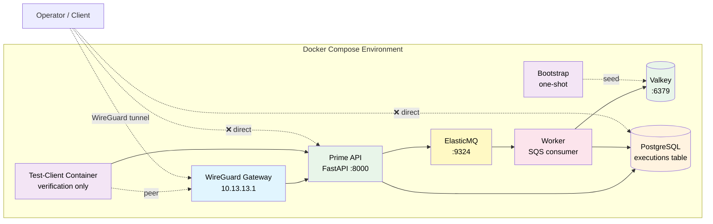
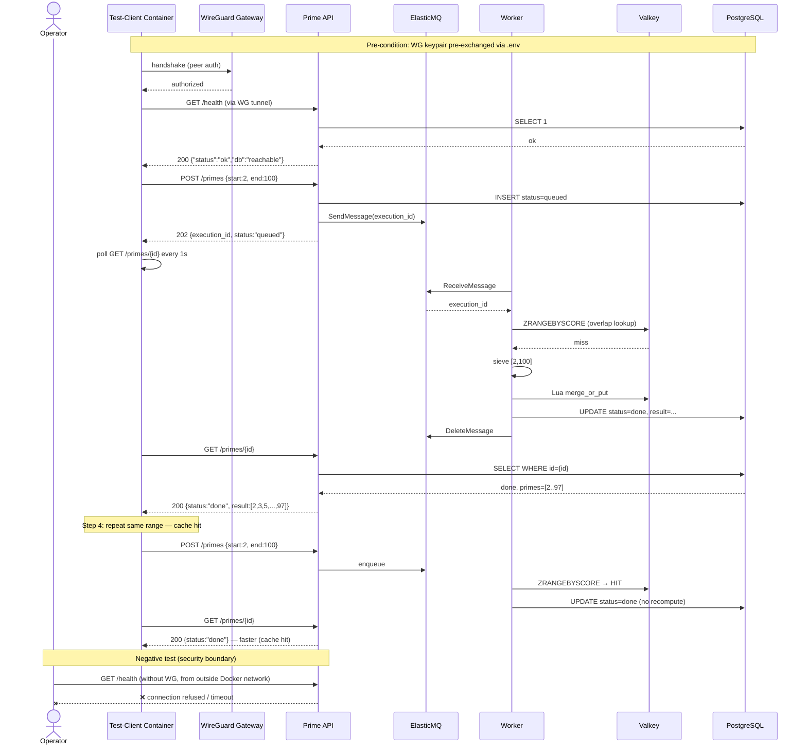

# aegis-enclave

> **Production-shape architecture at PoC scale.** A VPN-gated cloud microservice template with an agent-executable cross-cloud migration runbook. Part of the [`aegis-*`](https://binhsu.org) portfolio.

> Current state lives in the [Delivery Phases](#delivery-phases) table — the `State` column is the canonical answer to "where is the project right now?".

The repo is a runnable artifact, not a demo session. The smoke test in [§ Initial Acceptance](#initial-acceptance-smoke-test) lets a reviewer verify the security boundary in five commands without watching the author drive it.

---

## Service Contract

```
POST /primes → 202 + {execution_id}  |  GET /primes/{id} → {status, result?}
range cap: end - start ≤ 10⁷  |  overload: 503 + Retry-After: 60
cache hit < 100 ms  |  compute miss up to 60 s  |  NOT for sub-100 ms SLA
```

Full specification: [`docs/design_doc.md` § 4.0](docs/design_doc.md#40-service-specification).

## What's inside

| Concern | This repo |
|---|---|
| **Service** | FastAPI prime-number generator, async POST → queue → worker, VPN-only access |
| **Queue + worker** | SQS (ElasticMQ locally) + ECS Fargate worker pool; auto-scaling on queue depth |
| **Cache** | ElastiCache Serverless Valkey; ZSET schema + Lua range-coalescing; bootstrap one-shot ECS task |
| **Database** | PostgreSQL container, single tenant, execution audit table with status state machine |
| **Local verification harness** | Docker Compose stack with in-container test-client; WireGuard gateway here is a self-contained local fixture for the security-boundary test, not part of the deployment architecture |
| **Cloud target (AWS)** | Terraform with community modules — VPC, ECS Fargate behind internal ALB, RDS, SQS, ElastiCache Serverless, **AWS Client VPN endpoint**, Secrets Manager, ECR |
| **Cloud migration (e.g., IONOS / sovereign)** | Agent-executable runbook with service-mapping table; recommends self-hosted **NetBird** where managed VPN doesn't exist |
| **Operations** | Mermaid smoke-test sequence, capability-gated agent execution, scope-honest reliability targets |

The deployment architecture has one VPN: **AWS Client VPN endpoint**. The local Docker Compose stack ships with a WireGuard gateway as a self-contained verification harness so reviewers can prove the security boundary in five commands without standing up cloud — it is not part of the cloud architecture. **NetBird** (Berlin-based, EU-sovereign, self-hostable) is the recommended alternative when migrating to a cloud without a managed VPN endpoint. See [ADR-0006](docs/ADR/0006-vpn-three-tier-story.md).

---

## Folder structure

```
aegis-enclave/
├── README.md                          # this file
├── CLAUDE.md                          # operating manual for next agent / human
├── SECURITY.md                        # vulnerability disclosure policy (DevSecOps)
├── Makefile                           # declarative ops targets — `make help` to list
├── .pre-commit-config.yaml            # gitleaks + ruff + terraform fmt hooks (DevSecOps)
├── .github/
│   └── dependabot.yml                 # automated dependency updates (DevSecOps)
├── docker-compose.yml                 # one-shot demo: app + db + wg-gateway + test-client
├── Dockerfile                         # multi-stage, non-root, healthcheck
├── pyproject.toml                     # ruff + mypy + pytest config
├── src/
│   └── prime_service/
│       ├── main.py                    # FastAPI app (async POST 202 + backpressure)
│       ├── primes.py                  # prime logic (sieve / 6k±1 / SIGALRM budget)
│       ├── db.py                      # SQLAlchemy + asyncpg
│       ├── schemas.py                 # Pydantic models (Status enum + ExecutionResponse)
│       ├── queue.py                   # SQS abstraction (boto3, endpoint-url injectable)
│       ├── cache.py                   # Valkey abstraction (redis-py, ZSET + Lua merge)
│       ├── worker.py                  # SQS consumer loop (SIGALRM 60s, idempotency)
│       └── bootstrap.py              # one-shot cache pre-warm (idempotent)
├── tests/
│   ├── test_primes.py                 # unit tests for prime logic (BVA at _SIEVE_THRESHOLD, _RANGE_CEILING)
│   ├── test_api.py                    # API integration tests
│   ├── test_queue.py                  # queue abstraction tests
│   ├── test_cache.py                  # cache ZSET overlap matrix + Lua merge BVA
│   ├── test_worker.py                 # worker idempotency + SIGALRM tests
│   └── test_bootstrap.py             # bootstrap idempotency tests
├── wireguard/
│   ├── wg0.conf.template              # peer config skeleton (no key material)
│   └── README.md                      # how to generate keys + run locally
├── terraform/
│   ├── main.tf                        # provider + default_tags (FinOps) + community-module skeleton
│   ├── variables.tf                   # input variables
│   ├── outputs.tf                     # exposed outputs (filled in during Phase 1 build)
│   └── README.md                      # plan-only deployment guide (no apply per ADR-0015)
├── docs/
│   ├── ADR/                           # architecture decision records (Nygard MADR) — see `docs/ADR/`
│   │   ├── 0001-repo-identity-aegis-enclave.md
│   │   ├── 0002-time-budget-15h.md
│   │   ├── 0003-poc-scope-prod-hygiene.md
│   │   └── ... (numbered monotonically; see `docs/ADR/` for the full set)
│   ├── design_doc.md                  # Reliability + VPN Architecture (long form, written in Phase 1)
│   ├── deployment_guide.md            # Cloud deploy walkthrough + architecture diagram (Phase 1)
│   ├── migration_runbook.md           # Phase 2 — agent-executable cross-cloud migration spec
│   ├── scaling_runbook.md             # Phase 2 — agent-executable single→multi-region spec
│   └── production_adoption.md         # operator's "how to plug this into our AWS" guide
├── .gitignore                         # see CLAUDE.md § 2 for what's hidden
└── case_study/                        # gitignored — copyrighted source briefs
```

Files marked **gitignored** in [CLAUDE.md § 2](CLAUDE.md#2-files-and-their-roles) hold buyer-specific framing, copyrighted briefs, per-cycle execution notes, and the leak-guard pattern file. They never enter version control.

**Three-axis hygiene at a glance:**
- **GitOps** — `Makefile` declares all ops targets (`make help`); Terraform is the cloud's git-as-truth (community modules in `terraform/`)
- **DevSecOps** — `SECURITY.md` (disclosure), `.pre-commit-config.yaml` (gitleaks + ruff + terraform fmt at commit-time, full pytest gate at pre-push), `.github/workflows/ci.yml` (lint + pytest on every push and PR), `.github/dependabot.yml` (weekly automated updates), capability gates for AI agents in [`CLAUDE.md` § 7](CLAUDE.md#7-capability-gates-for-ai-agent-driven-work)
- **FinOps** — `terraform/main.tf` provider block declares `default_tags` (Project / Environment / CostCenter / Owner) for cost attribution; cost analysis recorded in [ADR-0006](docs/ADR/0006-vpn-three-tier-story.md) and [ADR-0015](docs/ADR/0015-no-k8s-no-real-apply.md)

---

## Architecture



The deployable cloud topology mirrors this shape with managed primitives — see [`docs/deployment_guide.md`](docs/deployment_guide.md).

---

## Quick start

```bash
# 1. Bring up the stack
docker compose up -d

# 2. Watch services come ready
docker compose logs -f --tail=20

# 3. Run the smoke test (see next section)
#    Either path works — smoke.sh self-bootstraps tooling if absent.
docker compose exec test-client ./smoke.sh        # preferred after `up -d`
# docker compose run --rm test-client ./smoke.sh  # one-off container, also works
```

## Prerequisites

Before running this repo:

- **Python 3.12+** (3.12 or 3.13 recommended; 3.14 supported)
- **Docker** or compatible runtime (OrbStack on macOS recommended)
- **Package manager** — pick one:
  - `uv` (preferred): `curl -LsSf https://astral.sh/uv/install.sh | sh` or `brew install uv`
  - or pip + venv: `python3.12 -m venv .venv && source .venv/bin/activate`

For Phase 2.5 (cloud deploy / acceptance gate):

- AWS CLI configured with credentials: `aws configure`
- Terraform 1.6+ (`brew install terraform` on macOS)
- AWS Client VPN client (Tunnelblick on macOS for `.ovpn` config)

For full local development (with linting + tests):

```bash
uv sync --dev               # or: pip install -e '.[dev]'
make pre-commit-install     # installs commit-time + pre-push hooks (one-off)
ruff check src tests
mypy src
pytest -v
```

`make pre-commit-install` wires up two stages:

| Stage | Hooks | When |
|---|---|---|
| **commit-time** | gitleaks (secret scan) + ruff (lint + format) + terraform fmt/validate | every `git commit` |
| **pre-push** | full `pytest` suite via `make test-ci` | every `git push` |

The pre-push pytest gate mirrors the `.github/workflows/ci.yml` GitHub Actions check — red tests are caught locally before they hit the remote, and the same gate guards the `main` branch on the server side.

---

## Initial Acceptance (Smoke Test)

The deliverable supports **two** acceptance gates that exercise different surfaces:

| Gate | What it proves | When |
|---|---|---|
| **Local stack acceptance** (below) | Security-boundary correctness — host can't reach app/DB; only the in-VPN test-client can. Six commands, two minutes, no cloud account required. | Today, against the running Docker Compose stack |
| **Cloud deployment acceptance** ([§ Cloud deployment acceptance](#cloud-deployment-acceptance-phase-25-pending)) | End-to-end path: macOS → AWS Client VPN tunnel → internal ALB → ECS Fargate `/primes` endpoint returns a list. Confirms the deployment architecture itself works against real AWS. | Phase 2.5 (pending real `terraform apply`) |

### Local stack acceptance

Structured as a sequence diagram so a reviewer can trace what each step proves about the system.



### Paste-and-run commands

```bash
# 1. VPN handshake check (run from inside test-client)
docker compose exec test-client wg show
# Expected: peer line with "latest handshake: <timestamp>"

# 2. Health (through VPN)
docker compose exec test-client \
  curl -sf http://api.enclave.local:8000/health
# Expected: {"status":"ok","db":"reachable"}

# 3. Submit a range (async POST → poll until done)
docker compose exec test-client \
  curl -sf -X POST http://api.enclave.local:8000/primes \
    -H "Content-Type: application/json" \
    -d '{"start":2,"end":100}'
# Expected: 202, {execution_id, status:"queued"}

# 3b. Poll until done (smoke.sh handles this automatically)
docker compose exec test-client \
  curl -sf http://api.enclave.local:8000/primes/<execution_id>
# Expected: status "done", primes array length 25

# 4. Repeat same range — verify cache hit (latency < first call)
docker compose exec test-client \
  curl -sf -X POST http://api.enclave.local:8000/primes \
    -H "Content-Type: application/json" \
    -d '{"start":2,"end":100}'
# then poll until done — should resolve faster (Valkey cache hit)

# 5. Out-of-bounds → schema rejection
docker compose exec test-client \
  curl -sf -X POST http://api.enclave.local:8000/primes \
    -H "Content-Type: application/json" \
    -d '{"start":2,"end":10000002}'
# Expected: 422 validation error

# 6. Negative test — bypass VPN
curl -m 5 http://localhost:8000/health
# Expected: connection refused / timeout
# (Proves API is not reachable outside the VPN network)
```

Six steps. Two minutes. Pass = system meets the brief's security boundary + async + cache requirements.

The `smoke.sh` script inside the test-client container runs all six steps automatically (including the polling loop) and exits 0 on full pass.

### Cloud deployment acceptance (Phase 2.5 — pending)

This gate exercises the **deployment-architecture VPN** (AWS Client VPN endpoint) end-to-end from a developer laptop. It only runs after Phase 2.5 completes a real `terraform apply` against a personal AWS account.

```text
[macOS Tunnelblick / native OpenVPN client]
        │  mutual-TLS handshake (client cert in ACM, see ADR-0024)
        ▼
[AWS Client VPN endpoint]  ──► VPC private subnet
        │
        ▼
[Internal ALB]  ──► [ECS Fargate task]  ──► [RDS PostgreSQL Multi-AZ]
```

```bash
# 1. (one-off) Bootstrap state backend + GHA OIDC role per ADR-0025/0026
make tf-bootstrap

# 2. (one-off) Generate Client VPN server + client certs and import to ACM (ADR-0024)
make ts-bootstrap-certs OPERATOR=<your-handle>

# 3. Uncomment `backend "s3"` and the auto-scaling block in terraform/main.tf,
#    paste cert ARNs into gitignored terraform/terraform.tfvars, then:
make tf-apply

# 4. Import the operator .ovpn package into Tunnelblick (or `openvpn3 session-start`)
#    and connect.

# 5. From macOS, with the VPN tunnel active — pre-flight curl plumbing per ADR-0027
#    (HTTPS on internal ALB via self-signed ACM-imported cert):
ALB_DNS=$(terraform -chdir=terraform output -raw alb_dns_name)
ALB_IP=$(dig +short $ALB_DNS | head -1)
terraform -chdir=terraform output -raw alb_self_signed_ca_pem > /tmp/alb-ca.pem

curl --cacert /tmp/alb-ca.pem \
     --resolve api.enclave.internal:443:${ALB_IP} \
     https://api.enclave.internal/primes \
     -X POST -H 'Content-Type: application/json' \
     -d '{"start":2,"end":100}'
# Expected: 200, primes array length 25, execution_id present.

# 6. Negative test — disconnect VPN, repeat the curl:
# Expected: timeout (ALB is in private subnets only — see ADR-0019).
```

Evidence is captured per [`docs/design_doc.md` § 3 (Observability posture)](docs/design_doc.md) — that section is the spec for what to screenshot and which logs to pull (aggregate dashboards + per-endpoint curl/log pairs + Client VPN handshake + `terraform output`). All artifacts land in [`docs/deployment_guide.md`](docs/deployment_guide.md). The stack is torn down immediately after evidence capture; the acceptance window is bounded to **≤ 3 hours**, with a total cost **under $2** (RDS Multi-AZ, Client VPN endpoint, ALB, and ECS Fargate are billed per hour, not per month — the historic "≈ $50/mo" framing only applies to a sustained deployment).

---

## Delivery Phases

The deliverable is staged into numbered phases (decimals allowed for sub-progress). Phase 1 fulfils the case-study brief; Phase 2 is forward-looking extension paths shaped as the same agent-executable spec format; Phase 3 is submission. Phase numbering rules are in [`CLAUDE.md` § 9](CLAUDE.md#9-commit-and-push-hygiene).

| Phase | State | Scope | Key artifacts |
|---|---|---|---|
| **0.0** | ✅ done | Repo init, remote bound | `.git/`, `README.md` (placeholder) |
| **0.1** | ✅ done | ADRs + docs scaffolding | `CLAUDE.md`, `docs/ADR/*.md` set, gitignored `strategy.md` + `*_steps.md` |
| **0.2** | ✅ done | Hygiene additions (GitOps × DevSecOps × FinOps) | `Makefile`, `.pre-commit-config.yaml`, `.github/dependabot.yml`, `SECURITY.md`, `terraform/` stub with `default_tags` |
| **1.1** | ✅ done | Service foundation | `src/prime_service/`, `tests/`, `pyproject.toml`, `db/init.sql`, `.env.example` |
| **1.2** | ✅ done | Container + VPN demo | `Dockerfile`, `docker-compose.yml`, `wireguard/`, `test-client/smoke.sh` |
| **1.3** | ✅ done | Cloud Terraform code (plan-only) | `terraform/main.tf` filled with community modules + Client VPN endpoint, `terraform/variables.tf`, `terraform/outputs.tf`, `terraform/terraform.tfvars.example` |
| **1.4** | ✅ done | Phase 1 docs | `docs/design_doc.md`, `docs/deployment_guide.md` (with Mermaid cloud architecture diagram) |
| **1.5** | ✅ done | Phase 1 smoke test passes | Verified on 2026-04-25: OrbStack docker daemon, `docker compose up --build` healthy, smoke test 5/5 (test-client → API → DB), negative test confirms host-side `:8000` + `:5432` both `Connection refused` — VPN-only boundary proven. Initial Acceptance achieved. Two real bugs caught and fixed during this gate (`.dockerignore` over-excluded README.md; Dockerfile's editable install path mismatched runtime layout) |
| **2.1** | ✅ done | Cross-cloud migration runbook | `docs/migration_runbook.md` — agent-executable spec, two tracks (Application + VPN modernisation) |
| **2.2** | ✅ done | Multi-region scaling runbook | `docs/scaling_runbook.md` — same format, single-region → multi-region axis |
| **2.3** | ✅ done | Async implementation (L1-L3) | `src/prime_service/queue.py`, `worker.py`, `bootstrap.py`; SQS + ElasticMQ local parity; POST → 202 + poll; backpressure middleware (503 + Retry-After); SIGALRM 60s per job; ADR-0029, ADR-0030, ADR-0032, ADR-0033 |
| **2.4** | ✅ done | Distributed cache (L4) | `src/prime_service/cache.py`; ElastiCache Serverless Valkey + ZSET + Lua range-coalescing; bootstrap ECS task; Valkey local parity; ADR-0031, ADR-0034; smoke test 6/6 passes (cache miss → done, cache hit logged, backpressure 503) |
| **2.5** | ⏳ pending | Cloud deployment live + AWS Client VPN end-to-end verified from local | `make tf-bootstrap` (state backend + GHA OIDC per ADR-0025/0026) → `make ts-bootstrap-certs OPERATOR=…` (Client VPN certs into ACM per ADR-0024) → uncomment `backend "s3"` + auto-scaling in `terraform/main.tf` → paste cert ARNs into gitignored `terraform.tfvars` → `make tf-apply` → connect via Client VPN client from macOS → `curl https://<alb-private>/primes` returns prime list → evidence captured per `docs/design_doc.md` § 3 + § 5 into `docs/deployment_guide.md`. ADR-0015 plan-only stance superseded for this phase. Cost: **< $2 for the 3-hour acceptance window**; stack torn down immediately after evidence captured |
| **3.0** | ⏳ pending | Polish + cover note | Final README pass, `cover_note.md` (gitignored) drafted |
| **3.1** | ⏳ pending | Repo published to private remote | Pre-push leak guard clean, repo invitation sent to recipient |
| **3.2** | ⏳ pending | Submission email sent | End of cycle |

**Phase 2 runbooks are spec-grade, not code-grade.** They describe step-by-step intent, verification commands, expected outputs, rollback paths, and capability gates — designed to be executed by either an AI coding agent (with human oversight on irreversible steps) or a human engineer following the spec. The mapping table at the top of each runbook is the only destination-specific artifact; the rest of the spec is invariant across destinations.

Why phase the delivery:

- **Phase 1 is the contract** with the brief. It is small, runnable, verifiable in five commands.
- **Phase 2 demonstrates judgement** beyond the brief — the candidate doesn't just answer the assignment, they show what they'd build next.
- **The same spec format** unifies both phases — once the runbook shape is proven once (cross-cloud), instantiating it for another axis (multi-region scaling) is mechanical work, not new design.

See [ADR-0012](docs/ADR/0012-migration-runbook-agent-executable.md) for the agent-executable spec design and [ADR-0007](docs/ADR/0007-single-region-multi-az.md) for why multi-region lives in Phase 2 rather than Phase 1.

---

## Cloud deployment

The cloud target is a Terraform composition built from `terraform-aws-modules/*` community modules and direct provider resources:

- **Private-only VPC** across two AZs (per [ADR-0019](docs/ADR/0019-private-only-vpc-architecture.md)) — no IGW, no NAT, no public subnets; egress to AWS APIs via 8 interface VPC Endpoints + 1 S3 gateway endpoint
- ECS Fargate behind **internal** ALB (private subnets only) — API service + worker service (auto-scaling on queue depth)
- **SQS** queue (`aegis-enclave-primes`, visibility timeout 90s) for async job dispatch
- **ElastiCache Serverless Valkey** for distributed prime-range cache (ZSET + Lua merge)
- **Bootstrap ECS task** (one-shot, Terraform `null_resource`) to pre-warm Valkey with `[1, 100,000]`
- RDS PostgreSQL Multi-AZ standby
- AWS Client VPN endpoint with mutual-TLS authentication (ingress)
- Secrets Manager + ECR + CloudWatch Logs (all reached via PrivateLink)

**The Terraform code is `plan`-only by default** — the brief accepts a deployment guide as sufficient (Task 3 of the source brief — gitignored under `case_study/`). For Phase 2.5 of this delivery, ADR-0015's plan-only stance is superseded so the AWS Client VPN end-to-end path can be verified from a developer laptop against a real personal AWS account; see the supersession block at the bottom of [ADR-0015](docs/ADR/0015-no-k8s-no-real-apply.md) and [§ Cloud deployment acceptance](#cloud-deployment-acceptance-phase-25-pending) above for the gate that consumes it.

For the full architectural walkthrough (Mermaid diagram, component table, network flow, plan walkthrough) see [`docs/deployment_guide.md`](docs/deployment_guide.md).

### Adopting in your AWS environment

If the operator wants to take this composition to a real account — what they need to provide (ACM certs, state backend, VPC CIDR coordination, cross-account ECR, tags, IAM bootstrap), what the repo already provides, and the adoption checklist — see [`docs/production_adoption.md`](docs/production_adoption.md).

---

## Cross-cloud migration

The migration runbook is structured as an **agent-executable spec**, not a static document. Each step has:

- `precondition` — what must be true before running
- `action` — described declaratively (not as cloud-specific code)
- `verify_cmd` — how to confirm the step succeeded
- `expected_output` — what success looks like
- `on_failure` — rollback or escalation
- `human_gate` — flag for steps requiring human approval (destructive or irreversible)

The runbook is **portable** — the only cloud-specific artifact is the service-mapping table at the top. To target a different destination cloud, swap the mapping table; the rest of the spec is invariant.

The runbook recommends **self-hosted [NetBird](https://netbird.io/)** for the VPN layer when migrating to clouds without a managed VPN endpoint. Cost analysis at typical team scale: ~170× reduction vs. AWS Client VPN. See [ADR-0006](docs/ADR/0006-vpn-three-tier-story.md) and [`docs/migration_runbook.md`](docs/migration_runbook.md).

---

## Reusability

The repo is structured so ~90 % is generic and ~10 % is buyer-specific top-layer framing held in `*_steps.md` (gitignored). Future case-study cycles reuse this template by:

1. Forking / branching this repo (or starting from `main`)
2. Refreshing the gitignored buyer-specific files for the new audience
3. Updating the `cover_note.md` and any narrative analogies in the design doc
4. Submitting via GitHub private repo + recipient invite

See [ADR-0004](docs/ADR/0004-reusability-90-10-split.md).

---

## Where to read next

- **Why each design choice was made** → [`docs/ADR/`](docs/ADR/) (read in numerical order)
- **How to run / extend the system** → [`CLAUDE.md`](CLAUDE.md)
- **Long-form design rationale** → [`docs/design_doc.md`](docs/design_doc.md)
- **Cloud deployment walkthrough** → [`docs/deployment_guide.md`](docs/deployment_guide.md)
- **Adopting in your AWS environment** → [`docs/production_adoption.md`](docs/production_adoption.md)
- **Cross-cloud migration spec (Phase 2)** → [`docs/migration_runbook.md`](docs/migration_runbook.md) (3 tracks: app + VPN + ECS→EKS)
- **Multi-region scaling spec (Phase 2)** → [`docs/scaling_runbook.md`](docs/scaling_runbook.md)

---

## License

Code: MIT (or as specified in `LICENSE`, when added)
Architecture decisions and prose: CC BY 4.0 (attribution to Pin-Feng (Bin) Hsu, [binhsu.org](https://binhsu.org)).

The `case_study/` directory contains third-party copyrighted briefs and is **never** committed.
