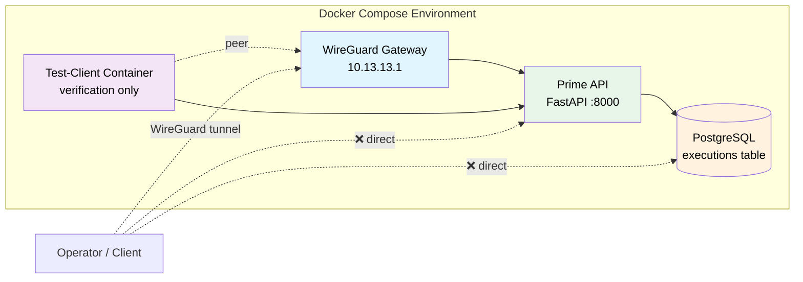
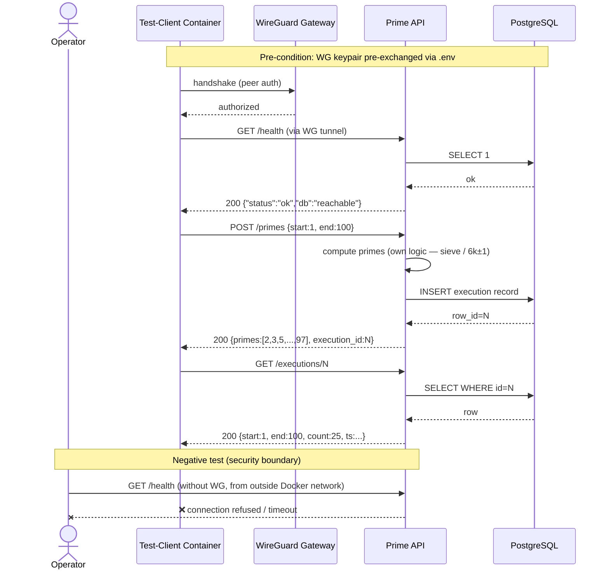

# aegis-enclave

> **Production-shape architecture at PoC scale.** A VPN-gated cloud microservice template with an agent-executable cross-cloud migration runbook. Part of the [`aegis-*`](https://binhsu.org) portfolio.

> Current state lives in the [Delivery Phases](#delivery-phases) table — the `State` column is the canonical answer to "where is the project right now?".

The repo is a runnable artifact, not a demo session. The smoke test in [§ Initial Acceptance](#initial-acceptance-smoke-test) lets a reviewer verify the security boundary in five commands without watching the author drive it.

---

## What's inside

| Concern | This repo |
|---|---|
| **Service** | FastAPI prime-number generator, three endpoints, VPN-only access |
| **Database** | PostgreSQL container, single tenant, execution audit table |
| **Local network** | Docker Compose, WireGuard container as VPN gateway, in-container test-client for verification |
| **Cloud target (AWS)** | Terraform with community modules — VPC, ECS Fargate behind internal ALB, RDS, **AWS Client VPN endpoint**, Secrets Manager, ECR |
| **Cloud migration (e.g., IONOS / sovereign)** | Agent-executable runbook with service-mapping table; recommends self-hosted **NetBird** where managed VPN doesn't exist |
| **Operations** | Mermaid smoke-test sequence, capability-gated agent execution, scope-honest reliability targets |

The architecture story is layered: WireGuard exists only as local demo plumbing, AWS Client VPN endpoint is the cloud-side primary, and NetBird (Berlin-based, EU-sovereign, self-hostable) is the recommended alternative when managed VPN is unavailable or cost-prohibitive. See [ADR-0006](docs/ADR/0006-vpn-three-tier-story.md).

---

## Folder structure

```
aegis-enclave/
├── README.md                          # this file
├── CLAUDE.md                          # operating manual for next agent / human
├── SECURITY.md                        # vulnerability disclosure policy (DevSecOps)
├── Makefile                           # declarative ops targets — `make help` to list
├── .pre-commit-config.yaml            # gitleaks + ruff + terraform fmt hooks (DevSecOps)
├── .github/
│   └── dependabot.yml                 # automated dependency updates (DevSecOps)
├── docker-compose.yml                 # one-shot demo: app + db + wg-gateway + test-client
├── Dockerfile                         # multi-stage, non-root, healthcheck
├── pyproject.toml                     # ruff + mypy + pytest config
├── src/
│   └── prime_service/
│       ├── main.py                    # FastAPI app
│       ├── primes.py                  # prime logic (sieve / 6k±1)
│       ├── db.py                      # SQLAlchemy + asyncpg
│       └── schemas.py                 # Pydantic models
├── tests/
│   ├── test_primes.py                 # unit tests for prime logic
│   └── test_api.py                    # API integration tests
├── wireguard/
│   ├── wg0.conf.template              # peer config skeleton (no key material)
│   └── README.md                      # how to generate keys + run locally
├── terraform/
│   ├── main.tf                        # provider + default_tags (FinOps) + community-module skeleton
│   ├── variables.tf                   # input variables
│   ├── outputs.tf                     # exposed outputs (filled in during Phase 1 build)
│   └── README.md                      # plan-only deployment guide (no apply per ADR-0015)
├── docs/
│   ├── ADR/                           # 16 architecture decision records (Nygard MADR)
│   │   ├── 0001-repo-identity-aegis-enclave.md
│   │   ├── 0002-time-budget-15h.md
│   │   ├── 0003-poc-scope-prod-hygiene.md
│   │   └── ... (0004 through 0016)
│   ├── design_doc.md                  # Reliability + VPN Architecture (long form, written in Phase 1)
│   ├── deployment_guide.md            # Cloud deploy walkthrough + architecture diagram (Phase 1)
│   ├── migration_runbook.md           # Phase 2 — agent-executable cross-cloud migration spec
│   ├── scaling_runbook.md             # Phase 2 — agent-executable single→multi-region spec
│   └── production_adoption.md         # operator's "how to plug this into our AWS" guide
├── .gitignore                         # see CLAUDE.md § 2 for what's hidden
└── case_study/                        # gitignored — copyrighted source briefs
```

Files marked **gitignored** in [CLAUDE.md § 2](CLAUDE.md#2-files-and-their-roles) hold buyer-specific framing, copyrighted briefs, per-cycle execution notes, and the leak-guard pattern file. They never enter version control.

**Three-axis hygiene at a glance:**
- **GitOps** — `Makefile` declares all ops targets (`make help`); Terraform is the cloud's git-as-truth (community modules in `terraform/`)
- **DevSecOps** — `SECURITY.md` (disclosure), `.pre-commit-config.yaml` (gitleaks + ruff + terraform fmt at commit-time, full pytest gate at pre-push), `.github/workflows/ci.yml` (lint + pytest on every push and PR), `.github/dependabot.yml` (weekly automated updates), capability gates for AI agents in [`CLAUDE.md` § 7](CLAUDE.md#7-capability-gates-for-ai-agent-driven-work)
- **FinOps** — `terraform/main.tf` provider block declares `default_tags` (Project / Environment / CostCenter / Owner) for cost attribution; cost analysis recorded in [ADR-0006](docs/ADR/0006-vpn-three-tier-story.md) and [ADR-0015](docs/ADR/0015-no-k8s-no-real-apply.md)

---

## Architecture



The deployable cloud topology mirrors this shape with managed primitives — see [`docs/deployment_guide.md`](docs/deployment_guide.md).

---

## Quick start

```bash
# 1. Bring up the stack
docker compose up -d

# 2. Watch services come ready
docker compose logs -f --tail=20

# 3. Run the smoke test (see next section)
docker compose run --rm test-client ./smoke.sh
```

For full local development (with linting + tests):

```bash
uv sync --dev               # or: pip install -e '.[dev]'
make pre-commit-install     # installs commit-time + pre-push hooks (one-off)
ruff check src tests
mypy src
pytest -v
```

`make pre-commit-install` wires up two stages:

| Stage | Hooks | When |
|---|---|---|
| **commit-time** | gitleaks (secret scan) + ruff (lint + format) + terraform fmt/validate | every `git commit` |
| **pre-push** | full `pytest` suite via `make test-ci` | every `git push` |

The pre-push pytest gate mirrors the `.github/workflows/ci.yml` GitHub Actions check — red tests are caught locally before they hit the remote, and the same gate guards the `main` branch on the server side.

---

## Initial Acceptance (Smoke Test)

This is the **one** verification the deliverable supports. It's structured as a sequence diagram so a reviewer can trace what each step proves about the system.



### Paste-and-run commands

```bash
# 1. VPN handshake check (run from inside test-client)
docker compose exec test-client wg show
# Expected: peer line with "latest handshake: <timestamp>"

# 2. Health (through VPN)
docker compose exec test-client \
  curl -sf http://api.enclave.local:8000/health
# Expected: {"status":"ok","db":"reachable"}

# 3. Submit a range
docker compose exec test-client \
  curl -sf -X POST http://api.enclave.local:8000/primes \
    -H "Content-Type: application/json" \
    -d '{"start":1,"end":100}'
# Expected: 200, primes array length 25, execution_id present

# 4. Audit lookup (use execution_id from step 3)
docker compose exec test-client \
  curl -sf http://api.enclave.local:8000/executions/<id>
# Expected: 200, {start, end, count, timestamp}

# 5. Negative test — bypass VPN
curl -m 5 http://localhost:8000/health
# Expected: connection refused / timeout
# (Proves API is not reachable outside the VPN network)
```

Five steps. Two minutes. Pass = system meets the brief's security boundary requirement.

---

## Delivery Phases

The deliverable is staged into numbered phases (decimals allowed for sub-progress). Phase 1 fulfils the case-study brief; Phase 2 is forward-looking extension paths shaped as the same agent-executable spec format; Phase 3 is submission. Phase numbering rules are in [`CLAUDE.md` § 9](CLAUDE.md#9-commit-and-push-hygiene).

| Phase | State | Scope | Key artifacts |
|---|---|---|---|
| **0.0** | ✅ done | Repo init, remote bound | `.git/`, `README.md` (placeholder) |
| **0.1** | ✅ done | ADRs + docs scaffolding | `CLAUDE.md`, 16 `docs/ADR/*.md`, gitignored `strategy.md` + `*_steps.md` |
| **0.2** | ✅ done | Hygiene additions (GitOps × DevSecOps × FinOps) | `Makefile`, `.pre-commit-config.yaml`, `.github/dependabot.yml`, `SECURITY.md`, `terraform/` stub with `default_tags` |
| **1.1** | ✅ done | Service foundation | `src/prime_service/`, `tests/`, `pyproject.toml`, `db/init.sql`, `.env.example` |
| **1.2** | ✅ done | Container + VPN demo | `Dockerfile`, `docker-compose.yml`, `wireguard/`, `test-client/smoke.sh` |
| **1.3** | ✅ done | Cloud Terraform code (plan-only) | `terraform/main.tf` filled with community modules + Client VPN endpoint, `terraform/variables.tf`, `terraform/outputs.tf`, `terraform/terraform.tfvars.example` |
| **1.4** | ✅ done | Phase 1 docs | `docs/design_doc.md`, `docs/deployment_guide.md` (with Mermaid cloud architecture diagram) |
| **1.5** | ✅ done | Phase 1 smoke test passes | Verified on 2026-04-25: OrbStack docker daemon, `docker compose up --build` healthy, smoke test 5/5 (test-client → API → DB), negative test confirms host-side `:8000` + `:5432` both `Connection refused` — VPN-only boundary proven. Initial Acceptance achieved. Two real bugs caught and fixed during this gate (`.dockerignore` over-excluded README.md; Dockerfile's editable install path mismatched runtime layout) |
| **2.1** | ✅ done | Cross-cloud migration runbook | `docs/migration_runbook.md` — agent-executable spec, two tracks (Application + VPN modernisation) |
| **2.2** | ✅ done | Multi-region scaling runbook | `docs/scaling_runbook.md` — same format, single-region → multi-region axis |
| **3.0** | ⏳ pending | Polish + cover note | Final README pass, `cover_note.md` (gitignored) drafted |
| **3.1** | ⏳ pending | Repo published to private remote | Pre-push leak guard clean, repo invitation sent to recipient |
| **3.2** | ⏳ pending | Submission email sent | End of cycle |

**Phase 2 runbooks are spec-grade, not code-grade.** They describe step-by-step intent, verification commands, expected outputs, rollback paths, and capability gates — designed to be executed by either an AI coding agent (with human oversight on irreversible steps) or a human engineer following the spec. The mapping table at the top of each runbook is the only destination-specific artifact; the rest of the spec is invariant across destinations.

Why phase the delivery:

- **Phase 1 is the contract** with the brief. It is small, runnable, verifiable in five commands.
- **Phase 2 demonstrates judgement** beyond the brief — the candidate doesn't just answer the assignment, they show what they'd build next.
- **The same spec format** unifies both phases — once the runbook shape is proven once (cross-cloud), instantiating it for another axis (multi-region scaling) is mechanical work, not new design.

**Phase 2 runbooks are spec-grade, not code-grade.** They describe step-by-step intent, verification commands, expected outputs, rollback paths, and capability gates — designed to be executed by either an AI coding agent (with human oversight on irreversible steps) or a human engineer following the spec. The mapping table at the top of each runbook is the only destination-specific artifact; the rest of the spec is invariant across destinations.

Why phase the delivery:

- **Phase 1 is the contract** with the brief. It is small, runnable, verifiable in five commands.
- **Phase 2 demonstrates judgement** beyond the brief — the candidate doesn't just answer the assignment, they show what they'd build next.
- **The same spec format** unifies both phases — once the runbook shape is proven once (cross-cloud), instantiating it for another axis (multi-region scaling) is mechanical work, not new design.

See [ADR-0012](docs/ADR/0012-migration-runbook-agent-executable.md) for the agent-executable spec design and [ADR-0007](docs/ADR/0007-single-region-multi-az.md) for why multi-region lives in Phase 2 rather than Phase 1.

---

## Cloud deployment

The cloud target is a Terraform composition built entirely from `terraform-aws-modules/*` community modules:

- **Private-only VPC** across two AZs (per [ADR-0019](docs/ADR/0019-private-only-vpc-architecture.md)) — no IGW, no NAT, no public subnets; egress to AWS APIs via 8 interface VPC Endpoints + 1 S3 gateway endpoint
- ECS Fargate behind **internal** ALB (private subnets only)
- RDS PostgreSQL Multi-AZ standby
- AWS Client VPN endpoint with mutual-TLS authentication (ingress)
- Secrets Manager + ECR + CloudWatch Logs (all reached via PrivateLink)

**The Terraform code in this repo is `plan`-only.** The brief explicitly accepts a deployment guide as sufficient (Task 3 of the source brief — gitignored under `case_study/`), and applying real AWS infrastructure is not the deliverable. See [ADR-0015](docs/ADR/0015-no-k8s-no-real-apply.md).

For the full architectural walkthrough (Mermaid diagram, component table, network flow, plan walkthrough) see [`docs/deployment_guide.md`](docs/deployment_guide.md).

### Adopting in your AWS environment

If the operator wants to take this composition to a real account — what they need to provide (ACM certs, state backend, VPC CIDR coordination, cross-account ECR, tags, IAM bootstrap), what the repo already provides, and the adoption checklist — see [`docs/production_adoption.md`](docs/production_adoption.md).

---

## Cross-cloud migration

The migration runbook is structured as an **agent-executable spec**, not a static document. Each step has:

- `precondition` — what must be true before running
- `action` — described declaratively (not as cloud-specific code)
- `verify_cmd` — how to confirm the step succeeded
- `expected_output` — what success looks like
- `on_failure` — rollback or escalation
- `human_gate` — flag for steps requiring human approval (destructive or irreversible)

The runbook is **portable** — the only cloud-specific artifact is the service-mapping table at the top. To target a different destination cloud, swap the mapping table; the rest of the spec is invariant.

The runbook recommends **self-hosted [NetBird](https://netbird.io/)** for the VPN layer when migrating to clouds without a managed VPN endpoint. Cost analysis at typical team scale: ~170× reduction vs. AWS Client VPN. See [ADR-0006](docs/ADR/0006-vpn-three-tier-story.md) and [`docs/migration_runbook.md`](docs/migration_runbook.md).

---

## Reusability

The repo is structured so ~90 % is generic and ~10 % is buyer-specific top-layer framing held in `*_steps.md` (gitignored). Future case-study cycles reuse this template by:

1. Forking / branching this repo (or starting from `main`)
2. Refreshing the gitignored buyer-specific files for the new audience
3. Updating the `cover_note.md` and any narrative analogies in the design doc
4. Submitting via GitHub private repo + recipient invite

See [ADR-0004](docs/ADR/0004-reusability-90-10-split.md).

---

## Where to read next

- **Why each design choice was made** → [`docs/ADR/`](docs/ADR/) (read in numerical order, 1–19)
- **How to run / extend the system** → [`CLAUDE.md`](CLAUDE.md)
- **Long-form design rationale** → [`docs/design_doc.md`](docs/design_doc.md)
- **Cloud deployment walkthrough** → [`docs/deployment_guide.md`](docs/deployment_guide.md)
- **Adopting in your AWS environment** → [`docs/production_adoption.md`](docs/production_adoption.md)
- **Cross-cloud migration spec (Phase 2)** → [`docs/migration_runbook.md`](docs/migration_runbook.md) (3 tracks: app + VPN + ECS→EKS)
- **Multi-region scaling spec (Phase 2)** → [`docs/scaling_runbook.md`](docs/scaling_runbook.md)

---

## License

Code: MIT (or as specified in `LICENSE`, when added)
Architecture decisions and prose: CC BY 4.0 (attribution to Pin-Feng (Bin) Hsu, [binhsu.org](https://binhsu.org)).

The `case_study/` directory contains third-party copyrighted briefs and is **never** committed.
