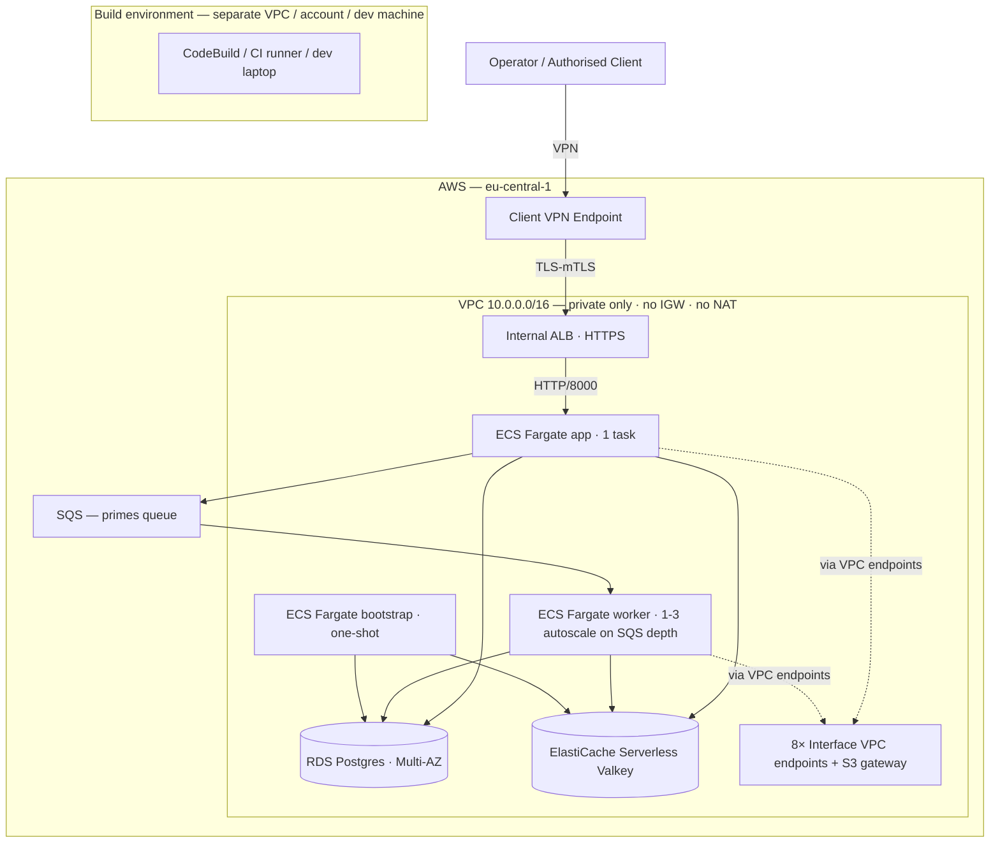

<!--
  case_study_report_template.md — generic markdown template for the per-cycle
  case-study report PDF that ships to the recipient as an email attachment.

  WHY THIS EXISTS
    The repo's evidence/ directory is .gitignored (per Phase 2.5 polish:
    ad-hoc evidence artifacts don't belong in committed history). When a
    cycle closes, the recipient needs a polished one-shot PDF summarising
    what was built + what's verifiable + the actual cycle-cost record. This
    template is the source for that PDF.

  HOW TO USE (per-cycle workflow)
    1. Copy this template to a recipient-named working file in REPO ROOT
       (matched by .gitignore's `report_*.md` pattern — never committed):
         cp docs/case_study_report_template.md report_<recipient>.md
       e.g. `report_Patrick.md`. Working in repo root keeps pandoc paths
       simple and survives a reboot (unlike /tmp).
    2. Fill in every {{PLACEHOLDER}} block with cycle-specific values
       (recipient name, account ID, evidence dates, actual cost, etc.)
    3. Render to PDF:
         brew install pandoc                          # one-off
         brew install --cask basictex                 # one-off (LaTeX engine)
         eval "$(/usr/libexec/path_helper)"           # ensure xelatex on PATH
         pandoc report_<recipient>.md \
                -o report_<recipient>.pdf \
                --pdf-engine=xelatex \
                --toc \
                -V geometry:margin=1in \
                -V mainfont="Helvetica" \
                -V monofont="Menlo" \
                -V colorlinks=true
    4. Attach the .pdf (NOT the .md) to the cycle-close email.

  RECIPIENT-FRAMING RULES (CLAUDE.md § 6)
    - The recipient-named .md is matched by .gitignore's `report_*.md`
      and never committed; the rendered .pdf is matched by .gitignore's
      repo-wide `*.pdf` rule (originally there for source case-study
      briefs; conveniently also covers per-cycle report PDFs).
    - Both files contain the recipient's name + contact details and per-
      cycle evidence — workspace artifacts only, never enter version
      control.
    - The committed template (THIS file) uses generic placeholder language
      and contains zero buyer-specific framing.
    - The rendered PDF is the deliverable; the .md is workspace artifact.
-->

# Case-study deliverable — `aegis-enclave`

**Recipient:** {{RECIPIENT_NAME}}
**Cycle:** {{CYCLE_LABEL}}
**Cycle close date:** {{CYCLE_CLOSE_DATE}}
**Cloud-acceptance evidence date:** {{EVIDENCE_DATE}}
**AWS account used for verification:** {{AWS_ACCOUNT_ID}} ({{AWS_REGION}})

---

## 1. What was built

`aegis-enclave` is a VPN-gated cloud microservice template — production-shape architecture at PoC scale. The deliverable is a runnable, reviewable, and forkable repository, not a hosted demo. Three verifiable shapes ship together:

1. **A runnable Python service** — async POST + poll API for a prime-computation workload, with idempotent retry, per-request 60s SIGALRM compute budget, and three-layer cost guard.
2. **A reproducible AWS deployment** — Terraform composition with internal ALB, ECS Fargate (app + worker), RDS PostgreSQL Multi-AZ, ElastiCache Serverless Valkey, SQS + DLQ, AWS Client VPN endpoint with mutual-TLS via easy-rsa PKI imported into ACM, 8 Interface VPC endpoints + S3 gateway, and zero internet egress (no IGW, no NAT).
3. **An agent-executable migration runbook** — cross-cloud and multi-region scaling specs that an AI agent or a human engineer can follow step-by-step, with capability gates (Auto / Confirm / Refuse) on every irreversible action.

The repo is ~{{LOC_TOTAL}} lines of Python + Terraform + Bash, with {{TEST_COUNT}} pytest tests passing on every push (CI gate).

## 2. Verification — what this PDF certifies

| Verification gate | Status | Evidence location |
|---|---|---|
| Local-stack acceptance (5 commands) | ✅ pass | `README.md` § Initial Acceptance — verifiable on any laptop with Docker |
| Cloud-stack acceptance (Phase 2.5 cycle) | ✅ pass | This PDF § 6 — captured during the {{EVIDENCE_DATE}} window |
| 7-step cloud smoke against deployed service | ✅ pass | This PDF § 6.1 — POST 202 / poll done / cache hit / partial-overlap / post-coalesce hit / 422 / backpressure |
| Bootstrap idempotency (schema + cache seed) | ✅ pass | This PDF § 6.2 — `schema_ensured` + `bootstrap_skip already_cached` log lines |
| Worker cache-hit ratio | ✅ pass | This PDF § 6.3 — CloudWatch worker log `cache_hit:compute_done` count |
| Collateral-free teardown (no orphan resources) | ✅ pass | This PDF § 6.4 — VPC / Client VPN / ACM / ECR all empty post-destroy |

## 3. Architecture (Mermaid → rendered as PDF figure)



Full architecture description with Components table and Network flow narrative: `docs/deployment_guide.md` § Cloud architecture.

## 4. Engineering decisions — the load-bearing five

The repo records {{ADR_COUNT}} ADRs in `docs/ADR/` with an [INDEX](../../docs/ADR/INDEX.md) sorted by reader goal. The five most load-bearing for understanding *why this looks the way it does*:

| ADR | Decision | Why it shapes the deliverable |
|---|---|---|
| [0003](../../docs/ADR/0003-poc-scope-prod-hygiene.md) | PoC feature surface + production-grade engineering (NOT production-grade operations) | Central in-scope vs out-of-scope discriminator |
| [0019](../../docs/ADR/0019-private-only-vpc-architecture.md) | Private-only VPC: no IGW, no NAT. All AWS API egress via 8 interface endpoints | Why the network has zero internet exit; cost trade-off documented |
| [0029](../../docs/ADR/0029-async-post-sqs-worker-pool.md) | POST returns 202 + queue + worker pool | Why the API + worker + SQS exist as distinct layers (vs synchronous compute) |
| [0031](../../docs/ADR/0031-elasticache-serverless-valkey-zset-lua-coalescing.md) | ElastiCache Serverless Valkey + ZSET + Lua range-coalescing | Why caching is distributed + atomic, not per-task in-memory |
| [0035](../../docs/ADR/0035-bootstrap-task-includes-schema-migration.md) | Bootstrap one-shot ECS task carries schema migration + cache seed | The driver pattern + Phase 2.5 reconsidered note on V2 split |

## 5. Cost shape

Steady-state idle ≈ **${{HOURLY_COST}}/hour** (eu-central-1 list price, {{COST_DATE}}). The forker decides their deployment duration; multiply by hours.

| Component | Hourly cost |
|---|---|
| Interface VPC endpoints (8 × 2 AZ) | $0.176 |
| Client VPN association (2 AZ) + 1 connected operator | $0.25 |
| ALB (idle) | $0.025 |
| RDS Multi-AZ db.t4g.micro + 20 GB gp3 | $0.037 |
| ECS Fargate (app + worker, 0.25 vCPU + 0.5 GB each) | $0.024 |
| ElastiCache Serverless Valkey (storage min) | $0.085 |
| **Steady-state subtotal** | **≈ $0.60** |

Full breakdown including per-traffic items + caveats + AWS Pricing Calculator pointer: `README.md` § Hourly cost + `docs/deployment_guide.md` § Cost shape.

**This cycle's actual cost** (Phase 2.5 acceptance window): **${{ACTUAL_COST}}** over {{WINDOW_HOURS}} hours apply-then-destroy. The 3h cap was OUR cycle's cost-ceiling for evidence capture; a forker chooses their own duration.

## 6. Cloud-acceptance evidence (captured {{EVIDENCE_DATE}})

### 6.1 Cloud smoke — 7/7 green

```
{{SMOKE_OUTPUT}}
```

Step-by-step interpretation: `docs/deployment_guide.md` § Phase 2.5 Cloud-acceptance evidence.

### 6.2 Bootstrap task idempotency

CloudWatch log lines (excerpt):

```
{{BOOTSTRAP_LOG_EXCERPT}}
```

`schema_ensured` confirms `Base.metadata.create_all` ran successfully on first apply. `bootstrap_skip already_cached` on subsequent invocation confirms `put_if_absent` is correctly NX-guarded.

### 6.3 Worker cache assertion (CloudWatch ground truth)

| Event | Count (last 10 min) | Expected from 7-step smoke |
|---|---|---|
| `cache_hit` | {{CACHE_HIT_COUNT}} | ≥ 2 (step 3 same-range repeat + step 5 post-coalesce hit) |
| `compute_done` | {{COMPUTE_DONE_COUNT}} | ≥ 2 (step 1 cache miss + step 4 partial-overlap) |

The smoke timer is wall-clock + network jitter. The CloudWatch worker log is the structlog event stream from inside the worker process — it is the authoritative record of which path the request took. See `cloud-evidence.sh` ground-truth counters block.

### 6.4 CloudWatch metric panels

| Panel | Status |
|---|---|
| SQS `ApproximateNumberOfMessagesVisible` | {{SQS_PNG_STATUS}} |
| ECS worker CPU + Memory utilization | {{ECS_PNG_STATUS}} |
| ElastiCache Serverless `BytesUsedForCache` | {{EC_BYTES_PNG_STATUS}} |
| ElastiCache Serverless `ProcessingUnits` (eCPU) | {{EC_ECPU_PNG_STATUS}} |
| ALB `TargetResponseTime` + `RequestCount` | {{ALB_PNG_STATUS}} |
| RDS `CPUUtilization` + `DatabaseConnections` | {{RDS_PNG_STATUS}} |

PNG attachments accompany this PDF in the email, captured via `aws cloudwatch get-metric-widget-image` (the API path; the AWS Console was blocked at the org by `cloudwatch:ListMetrics` SCP — a positive signal of organisation-level guardrails on the staging account).

### 6.5 Collateral-free teardown

```
{{TEARDOWN_OUTPUT}}
```

Post-destroy verification commands and outputs:

```
{{POST_DESTROY_VERIFY}}
```

All buckets empty: VPC / Client VPN / ACM / ECR / ENIs / Security Groups for the project tag.

## 7. What this deliverable is NOT

| Out of scope | Why not |
|---|---|
| Hosted live demo | The deliverable is a build-and-leave artifact (ADR-0013); the cloud-acceptance window is bounded apply-then-destroy |
| CI/CD pipeline beyond plan-only | The PR-time `terraform plan` workflow exists (ADR-0026); deploy-from-CI is V2 work documented in `docs/deployment_guide.md` § Production hardening |
| Observability stack (Prometheus / Grafana / Datadog / X-Ray) | PoC scope per ADR-0003. CloudWatch metrics + structured logs ship; dashboard / alarm wiring / on-call rotation is V2 |
| Multi-region | Single region by design; multi-region triggers + runbook in `docs/migration_runbook.md` |
| Production cost discipline (Budgets cap, Cost Anomaly Detection) | `default_tags` for cost attribution ship; Budgets / Anomaly are V2 forker-add items in `docs/deployment_guide.md` § Production hardening |
| Production secrets discipline (rotation Lambda) | Manual rotation procedure documented (ADR-0037); rotation Lambda is V2 |
| DLQ auto-retry worker | Anti-pattern (ADR-0038). DLQ pattern = alarm + manual triage via `scripts/dlq-triage.sh` |

## 8. Production hardening checklist (forker's V2 path)

Eight items the deliverable explicitly defers, with ADR pointers and the upgrade path for each:

1. Secrets Manager rotation (ADR-0037) — interim manual procedure documented
2. ALB cert path → ACM PCA (ADR-0027) — declared in ADR Future section
3. Bootstrap driver replacement (ADR-0035 reconsidered) — `null_resource` → Step Functions + db_migrate split
4. Observability stack (ADR-0003) — Prometheus / Grafana / Datadog / SNS
5. Multi-region (ADR-0009) — runbook in `docs/migration_runbook.md`
6. VPC Flow Logs — ~5 lines TF + S3 lifecycle policy
7. Dependabot / Renovate — `uv.lock` + terraform exact-pin would otherwise rot
8. Budgets cap + Cost Anomaly Detection — ~25 lines TF; the inflection from "cost-aware" to "FinOps-disciplined"

Full checklist with rationale + ~10-15 line TF sketches: `docs/deployment_guide.md` § Production hardening checklist.

## 9. How to reproduce locally

Local-stack (no AWS account required):

```bash
git clone {{REPO_URL}}
cd aegis-enclave
make install        # auto-detects uv vs pip; honors uv.lock if uv present
make up             # docker-compose: API + worker + DB + Valkey + ElasticMQ + WireGuard
make smoke          # 5/5 from inside test-client (proves VPN-only boundary)
make negative       # confirms host-side :8000 / :5432 are unreachable
make down           # tear down
```

Cloud-stack (requires AWS account + IAM perms per `docs/iam-permissions.md`):

```bash
make cloud-up       # ~30 min for ~88 resources (VPC, RDS, ECS, ALB, VPN, …)
# (connect VPN client per script's printed instructions)
make cloud-smoke    # 7/7 green
make cloud-evidence # capture CloudWatch artifacts BEFORE teardown
make cloud-down     # collateral-free destroy
```

## 10. Repository pointers

| Resource | Path |
|---|---|
| Repo | {{REPO_URL}} |
| README (entry point) | `README.md` |
| ADR index (38 ADRs grouped by reader goal) | `docs/ADR/INDEX.md` |
| Deployment guide (cloud architecture + cost + production hardening) | `docs/deployment_guide.md` |
| Design doc (service spec + reliability + observability + cache) | `docs/design_doc.md` |
| Migration runbook (cross-cloud) | `docs/migration_runbook.md` |
| Scaling runbook (multi-region) | `docs/scaling_runbook.md` |

---

*Generated from `docs/case_study_report_template.md` for cycle {{CYCLE_LABEL}}.*
