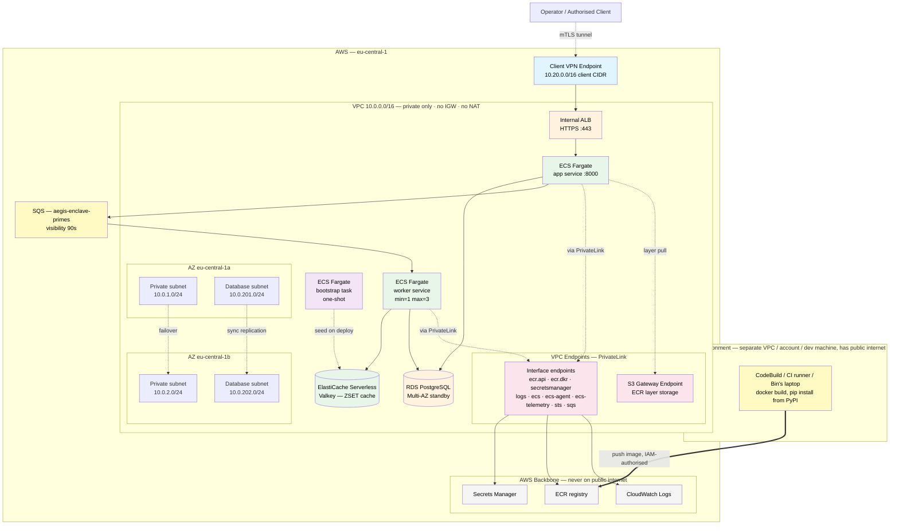

# Deployment Guide — aegis-enclave (AWS)

## Scope of this guide

This guide describes the Terraform composition under [`terraform/`](../terraform/). The composition was developed **plan-only** through Phase 1 (ADR-0015 — the brief's Task 3 reads "A list of clear instructions would suffice"), then runs through **one bounded cloud-acceptance window in Phase 2.5** — `terraform apply` against a personal AWS account, ≤ 3 hours, evidence captured into [§ Phase 2.5 Cloud-acceptance evidence](#phase-25-cloud-acceptance-evidence) below, then `terraform destroy`. ADR-0015's plan-only stance is partially superseded for that one window (see ADR-0015's supersession block) — outside the window, the composition remains code + plan, no sustained live state.

If the buyer asks "could you actually deploy this?" — the Phase 2.5 evidence section is the answer to "yes, and we did, end-to-end with VPN-from-laptop". If the buyer asks "could we run this in production?" — the runbook (ADR-0012) carries the cross-cloud architectural differentiator and the design doc carries the observability + reliability sketches.

The local Docker Compose layout is documented in [`README.md` § Architecture](../README.md#architecture); the diagram below is the cloud-side companion.

### Forker prerequisites

This guide assumes you have completed the README's Prerequisites and run `make install`. Additionally, for the cloud-acceptance gate (Phase 2.5):

- AWS account with the IAM permissions listed in [`docs/iam-permissions.md`](iam-permissions.md) (two-tier policy: pre-flight read-only + full deploy with `PowerUserAccess` + IAM-scoped) — covers all `make cloud-up` / `make cloud-down` / `make cloud-smoke` / `make cloud-evidence` targets, plus a CI runner section with a GitHub Actions OIDC sketch
- System tools (one-time, via Homebrew on macOS): `brew install easy-rsa pip-audit` — easy-rsa is required by `scripts/bootstrap-vpn-certs.sh` to generate the Client VPN PKI; pip-audit backs `make audit` for supply-chain scanning. Both fail loudly with the brew install command if missing.
- AWS region selected (default `eu-central-1` — see `terraform/variables.tf`)
- VPC quotas sufficient for one VPC + 2 private subnets + 2 public subnets + 1 NAT gateway + 1 ALB + 1 ECS cluster + 1 ElastiCache Serverless cache + 1 Client VPN endpoint
- Cost ceiling awareness: a 3h apply window typically costs **< $2** at us-east-1 / eu-central-1 rates; verify in AWS Pricing Calculator before apply if your account has unusual pricing
- (Optional, recommended) AWS Cost Explorer enabled to see the actual spend post-destroy

Local-stack acceptance (Phase 1.5) only requires the README Prerequisites — no AWS setup needed.

## Cloud architecture



**Network privacy posture (per ADR-0019)**: this VPC has **no Internet Gateway, no NAT, no public subnets**. Ingress is gated by AWS Client VPN endpoint (per ADR-0006); runtime egress to AWS APIs goes via VPC Endpoints (PrivateLink). The data plane never touches the public internet.

**Build vs runtime separation**: image construction (`docker build`, `pip install` from PyPI) happens in a separate build environment with public-internet access — never inside this VPC. Cross-account ECR access is an IAM concern, not a networking one. The runtime VPC stays fully private regardless of how CI/CD evolves.

## Components

| Component | Purpose | Module / resource | ADR |
|---|---|---|---|
| VPC + private subnets only (no NAT, no IGW) | Two-AZ private network — runtime egress via PrivateLink | `terraform-aws-modules/vpc/aws ~> 5.8` | ADR-0007, ADR-0016, ADR-0019 |
| VPC Endpoints — 8 interface (`ecr.api`/`ecr.dkr`/`secretsmanager`/`logs`/`ecs`/`ecs-agent`/`ecs-telemetry`/`sts`) + 1 S3 gateway | PrivateLink routes for AWS API egress; data plane never on public internet | `aws_vpc_endpoint` (direct provider) + `terraform-aws-modules/security-group/aws ~> 5.2` for endpoint SG | ADR-0019, ADR-0018 |
| Internal ALB | Private HTTPS load balancer; not internet-facing; self-signed ACM cert | `terraform-aws-modules/alb/aws ~> 9.9` | ADR-0011, ADR-0016, ADR-0027 |
| ECS Fargate — API service | HTTP tier; no compute; async POST + GET polling | `terraform-aws-modules/ecs/aws ~> 5.11` | ADR-0015, ADR-0016, ADR-0029 |
| ECS Fargate — worker service | SQS consumer; prime compute + cache write; auto-scaling min=1 max=3 | `aws_ecs_service.worker` + `aws_appautoscaling_policy` (direct provider) | ADR-0029, ADR-0033 |
| ECS Fargate — bootstrap task | One-shot: seeds Valkey with primes `[1, 100_000]` on first deploy | `aws_ecs_task_definition.cache_bootstrap` + `null_resource.run_cache_bootstrap` | ADR-0031 |
| SQS queue (`aegis-enclave-primes`) | Job dispatch; visibility timeout 90s; DLQ skeleton | `aws_sqs_queue` (direct provider) | ADR-0029, ADR-0030 |
| ElastiCache Serverless Valkey | Distributed prime-range cache; ZSET + Lua range-coalescing; scales to zero at idle | `aws_elasticache_serverless_cache` (direct provider) | ADR-0031 |
| RDS PostgreSQL Multi-AZ | Audit-table store with synchronous standby; status state machine | `terraform-aws-modules/rds/aws ~> 6.7` | ADR-0009, ADR-0008 |
| ECR repository | Image registry, IMMUTABLE tags, scan-on-push | `terraform-aws-modules/ecr/aws ~> 2.3` | ADR-0016 |
| AWS Client VPN endpoint | Cloud-side VPN gateway, mTLS-authenticated | `aws_ec2_client_vpn_endpoint` (direct provider — no mature module) | ADR-0006, ADR-0010 |
| Secrets Manager (RDS-managed) | RDS master password, no plaintext in code | `manage_master_user_password = true` on RDS module | ADR-0016 |
| ALB security group | Ingress only from VPC CIDR (Client VPN clients arrive via VPC routes) | `terraform-aws-modules/security-group/aws ~> 5.2` | ADR-0011 |
| App security group | Accept :8000 only from ALB SG | `terraform-aws-modules/security-group/aws ~> 5.2` | ADR-0011 |
| Worker security group | Accept outbound to Valkey :6379 + RDS :5432 + SQS (via VPC Endpoint) | `terraform-aws-modules/security-group/aws ~> 5.2` | ADR-0011 |
| RDS security group | Accept :5432 only from app + worker SG | `terraform-aws-modules/security-group/aws ~> 5.2` | ADR-0011 |

## Network flow

The happy path traverses the diagram top to bottom:

1. **Operator authenticates to the Client VPN endpoint.** Mutual TLS using the certificate chain configured via `client_cert_arn` / `server_cert_arn`. The endpoint advertises a client CIDR of `10.20.0.0/16`, which avoids overlap with the VPC CIDR (`10.0.0.0/16`).
2. **VPN client receives routes to the VPC.** Subnet associations span both private subnets (`10.0.1.0/24` in AZ-a, `10.0.2.0/24` in AZ-b) so the VPN endpoint stays available across an AZ failure. An authorisation rule allows VPN clients to reach the VPC CIDR.
3. **From inside the VPC, the operator hits the internal ALB.** The ALB has `internal = true` and no public DNS — it is reachable only from inside the VPC routing table, which the VPN client now is.
4. **ALB forwards to ECS Fargate** on port 8000 with `target_type = "ip"`. Health checks hit `/health` every 30 seconds; the FastAPI app returns DB reachability as part of that response.
5. **ECS task reads the DB password from Secrets Manager** at startup (the RDS module's `manage_master_user_password = true` integration produces the secret ARN, which is wired into the task definition's `secrets` block) and queries RDS over port 5432 inside a database subnet.
6. **RDS Multi-AZ** holds a synchronous standby in the second AZ. Synchronous commit gives RPO < 1min for in-flight transactions; auto-failover completes in ~2-5 minutes on AZ failure, satisfying the RTO ≤ 15min target from ADR-0008.

The negative path verifies VPN-only access:

- **Public internet → ALB**: blocked. The ALB is `internal = true` with no public DNS record; nothing on the internet can resolve or route to it.
- **VPC clients without VPN authentication**: also blocked at the SG layer in practice, because Client VPN clients arrive via the same VPC routing the SG ingress rule allows. Without successful mTLS to the Client VPN endpoint, there is no VPC route for the client to use.

## How to plan

The Terraform composition is reachable through the Makefile.

```bash
# 1. Provide variables (copy example, edit if needed)
cp terraform/terraform.tfvars.example terraform/terraform.tfvars

# 2. Initialise (no remote state — plan-only per ADR-0015)
make tf-init

# 3. Generate plan
make tf-plan
```

Notes on the plan-only posture (see [`terraform/README.md`](../terraform/README.md) for the full discipline):

- **No real AWS credentials are required for `terraform plan`.** The configuration deliberately avoids `data "aws_*"` lookups that would hit the AWS API at plan time. Plan completes purely from the variable inputs and provider schema.
- **`server_cert_arn` and `client_cert_arn` are placeholder values** in the example tfvars. They satisfy the type constraint so `terraform plan` succeeds; a real `terraform apply` would require ACM-provisioned certificates, which is treated as an out-of-band prerequisite. The candidate is testing infrastructure composition, not certificate authority operations.
- **`make tf-init` runs `terraform init -backend=false`** — no remote state for the case-study cycle.

## Cost shape

The composition surfaces FinOps signals as architectural choices, not as a separate cost-modelling exercise:

- **`default_tags` on the AWS provider** tag every resource with `Project` / `Environment` / `CostCenter` / `Owner` / `Repository`. Cost attribution scaffolding is in place from day one.
- **ECS Fargate over EKS** avoids the ~$73/month EKS control-plane fee at PoC scale (ADR-0015). Fargate is the appropriate-complexity managed primitive for the workload; EKS becomes a Phase 2 conversation only if the buyer's actual workload demands it.
- **Single NAT gateway** (`single_nat_gateway = true`) rather than per-AZ NAT — a deliberate cost discipline for PoC scale. A production deployment would re-evaluate this; the trade-off is documented inline in `terraform/main.tf`.
- **Client VPN endpoint cost analysis** from ADR-0006: ~$1,400/month at 30-user / 2-AZ / 24-7 operation versus ~$8/month for self-hosted NetBird at the same scale (~170× TCO reduction). This is the cost driver behind the migration runbook's recommendation in [`docs/migration_runbook.md`](migration_runbook.md), not a political framing.

## Cross-cloud and scaling

Cross-cloud migration to alternative providers (the brief names IONOS as one such target) is delivered as an agent-executable runbook in [`docs/migration_runbook.md`](migration_runbook.md). The rationale for "runbook, not parallel Terraform per cloud" is recorded in ADR-0005 — real cross-cloud Terraform requires real per-cloud expertise that the 22h budget (per ADR-0028, originally 15h) does not accommodate, and faking it is detectable. The runbook structure (precondition / action / verify_cmd / expected_output / on_failure / human_gate) carries the architectural intent without pretending the implementation is already done.

Single-region → multi-region scaling lives in [`docs/scaling_runbook.md`](scaling_runbook.md) as a second instance of the same agent-executable schema. The triggers that would move multi-region from Phase 2 plan to Phase 1 implementation are recorded in ADR-0007. Two instances make the runbook format credible as a portfolio template; one would just be a one-off. See ADR-0012 for the full agent-executable spec design.

## Phase 2.5 Cloud-acceptance evidence

> **STATUS: not yet captured — skeleton section pre-baked.** Replace `<TBD>` markers and empty blocks with real artefacts when the cloud-acceptance window runs. Bounded to ≤ 3 hours, < $2 total cost, then `terraform destroy`. Spec lives in [`docs/design_doc.md` § 3 (Observability posture)](design_doc.md) and § 5 (Cache distribution); operational checklist lives in `strategy.md` § 3 Phase 2.5 sequence (gitignored); irreversible-destroy reminder lives in the `feedback_phase25_screenshot_evidence.md` memory rule.
>
> **Redaction discipline before commit:** AWS account ID, full ARNs, full Client VPN endpoint IDs, ALB DNS, RDS endpoint hostnames, and any operator PII must be partially redacted (e.g., `123456789012` → `XXXXXXX89012`, `arn:aws:.../i-0abc...` → `arn:aws:.../i-XXXX...`). Re-run `make pre-push-check` before commit; visually grep the diff for 12-digit numeric strings and `arn:aws:` prefixes.

| Field | Value |
|---|---|
| Captured | `<TBD: YYYY-MM-DD HH:MM CEST>` |
| Operator | `<TBD: handle>` |
| AWS account ID | `<TBD: 12-digit ID, partially redacted>` |
| AWS region | `eu-central-1` |
| Acceptance window duration | `<TBD: Xh Ym>` |
| Total AWS cost (final bill line items) | `<TBD: $X.XX>` |
| `terraform apply` from commit | `<TBD: SHA>` |

### `terraform output`

Full `terraform output` after `make tf-apply` completes. Includes ALB DNS, RDS endpoint, Client VPN endpoint ID, and tag verification.

```
<TBD: paste terraform output verbatim, redacted>
```

### Per-endpoint round-trips

Three manual `curl` invocations against the live VPN-only endpoint, each capturing request and full response. Pre-flight plumbing per ADR-0027 (HTTPS on internal ALB via self-signed ACM-imported cert):

```bash
$ ALB_DNS=$(terraform -chdir=terraform output -raw alb_dns_name)
$ ALB_IP=$(dig +short $ALB_DNS | head -1)
$ terraform -chdir=terraform output -raw alb_self_signed_ca_pem > /tmp/alb-ca.pem
$ CURL="curl --cacert /tmp/alb-ca.pem --resolve api.enclave.internal:443:${ALB_IP}"
```

The `execution_id` from the `POST /primes` response feeds the third call.

#### `GET /health`

```bash
$ $CURL https://api.enclave.internal/health
```
```json
<TBD: response — expected {"status":"ok","db":"reachable","version":"0.1.0"}>
```

#### `POST /primes`

```bash
$ $CURL https://api.enclave.internal/primes \
    -X POST -H 'Content-Type: application/json' \
    -d '{"start":2,"end":100}'
```
```json
<TBD: response — expected 200, primes array length 25, execution_id present>
```

Captured `execution_id`: `<TBD>`

#### `GET /executions/{execution_id}`

```bash
$ $CURL https://api.enclave.internal/executions/<TBD-execution_id>
```
```json
<TBD: audit row — expected start=2, end=100, primes_count=25, created_at>
```

#### Negative test (VPN disconnected)

```bash
$ # disconnect VPN from Tunnelblick / openvpn3
$ $CURL --max-time 5 https://api.enclave.internal/health
```
```
<TBD: expected timeout / connection refused — proves private-only routing per ADR-0019>
```

### ALB access logs (S3)

The three `curl` requests above generate three lines in the ALB's S3 access-log bucket. Pulled here for the per-request audit trail.

```
<TBD: 3 ALB access log lines>
```

Pull command for reference:
```bash
aws s3 cp s3://<TBD-alb-logs-bucket>/AWSLogs/<TBD-acct>/elasticloadbalancing/eu-central-1/<TBD-YYYY/MM/DD>/ - \
  --recursive | gunzip | grep -E '/health|/primes|/executions'
```

### ECS API application logs (CloudWatch)

FastAPI structured log lines emitted while serving the three `curl` requests. CloudWatch log group: `/aws/ecs/aegis-enclave-app-<TBD-env>`.

```
<TBD: 3 structured log lines correlating to the curl timestamps (POST enqueue, GET queued, GET done)>
```

Pull command for reference:
```bash
aws logs filter-log-events \
  --log-group-name /aws/ecs/aegis-enclave-app-<TBD-env> \
  --start-time <TBD-curl-window-start-epoch-ms> \
  --end-time <TBD-curl-window-end-epoch-ms>
```

### ECS worker logs (CloudWatch)

Worker structured log lines showing SQS receive, cache lookup (miss/hit), sieve compute, Lua merge, DB audit write, and SQS ack for the smoke-test jobs. CloudWatch log group: `/aws/ecs/aegis-enclave-worker-<TBD-env>`.

```
<TBD: worker log lines — expected: receive job, cache MISS, sieve start, sieve done, Lua merge, DB update status=done, SQS ack>
<TBD: second job same range — expected: receive job, cache HIT, DB update status=done, SQS ack (no sieve compute)>
```

Pull command for reference:
```bash
aws logs filter-log-events \
  --log-group-name /aws/ecs/aegis-enclave-worker-<TBD-env> \
  --start-time <TBD-window-start-epoch-ms> \
  --end-time <TBD-window-end-epoch-ms>
```

### Bootstrap task logs (CloudWatch)

One-shot bootstrap ECS task log output. Should show Valkey seed success (or idempotent skip). CloudWatch log group: `/aws/ecs/aegis-enclave-bootstrap-<TBD-env>`.

```
<TBD: bootstrap log — expected: "seeding primes [1, 100000]... done" or "cache already seeded, skipping">
```

Pull command for reference:
```bash
# Find the bootstrap task's log stream (task ID visible in `aws ecs list-tasks`)
aws logs get-log-events \
  --log-group-name /aws/ecs/aegis-enclave-bootstrap-<TBD-env> \
  --log-stream-name <TBD-stream-name>
```

### Aggregate metric dashboards (CloudWatch screenshots)

Per [`docs/design_doc.md` § 3.1](design_doc.md) and § 5 — dashboards captured during the live window before teardown. Screenshots land under `docs/evidence/phase25/`.

| Dashboard | Metrics shown | Screenshot |
|---|---|---|
| ALB | `RequestCount` / `TargetResponseTime` p50/p90/p99 / 5xx counts / `HealthyHostCount` | `<TBD: docs/evidence/phase25/alb-metrics.png>` |
| ECS API service | per-task `CPUUtilization` / `MemoryUtilization` | `<TBD: docs/evidence/phase25/ecs-api-health.png>` |
| ECS worker service | `DesiredCount` (auto-scaling graph) / per-task `CPUUtilization` / `MemoryUtilization` | `<TBD: docs/evidence/phase25/ecs-worker-health.png>` |
| SQS queue | `ApproximateNumberOfMessagesVisible` (queue depth) / `NumberOfMessagesSent` / `NumberOfMessagesDeleted` | `<TBD: docs/evidence/phase25/sqs-queue-depth.png>` |
| ElastiCache Serverless Valkey | `BytesUsedForCache` / `ElastiCacheProcessingUnits` (ECPU consumption) / `CacheHits` / `CacheMisses` | `<TBD: docs/evidence/phase25/valkey-cache-metrics.png>` |
| RDS | `CPUUtilization` / `DatabaseConnections` / `FreeableMemory` / `ReplicaLag` | `<TBD: docs/evidence/phase25/rds-metrics.png>` |
| Client VPN endpoint | `ActiveConnectionsCount` / `AuthenticationFailures` / `IngressBytes` / `EgressBytes` | `<TBD: docs/evidence/phase25/client-vpn-metrics.png>` |

### VPN handshake

Tunnelblick (or `openvpn3`) connection-status pane showing successful mTLS handshake and connect timestamp.

`<TBD: docs/evidence/phase25/vpn-handshake.png>`

### Stack teardown confirmation

`terraform destroy` summary plus `aws ec2 describe-client-vpn-endpoints` confirmation that the Client VPN endpoint is gone (the most common cost-leak resource if a destroy partially fails).

```
<TBD: terraform destroy summary — "Destroy complete! Resources: NN destroyed.">
```

```bash
$ aws ec2 describe-client-vpn-endpoints --region eu-central-1
```
```json
<TBD: empty {"ClientVpnEndpoints": []} confirms full teardown>
```

---

## What this guide is NOT

- **Not a continuous-operations record.** Phase 2.5 above captures one bounded acceptance window (≤ 3h, then `terraform destroy`) — not a record of a sustained production deployment. Ongoing live state is not committed.
- **Not an operations runbook for a live service.** That would need an observability stack (on-call rotations, alerting, incident runbooks) — all out of scope per ADR-0003. The Observability posture section in `docs/design_doc.md` § 3 sketches the architectural extension; this guide does not implement it.
- **Not a cost projection.** The `default_tags` set up the cost-attribution scaffold; a real cost model needs production traffic data. Phase 2.5's < $2 acceptance window is a one-shot bounded number, not a sustained-cost extrapolation.

This is a deployment guide for a Terraform composition that is reviewable as code, planned to verify shape, and exercised once end-to-end against real AWS via the Phase 2.5 acceptance window. The brief asks for a deployment guide and accepts a guide as sufficient. This is that guide, with one bounded real-run receipt attached.
