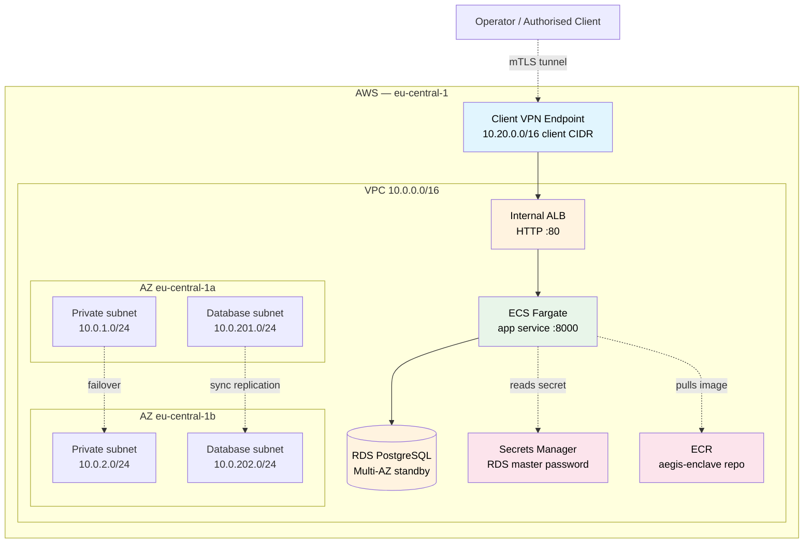

# Deployment Guide — aegis-enclave (AWS, plan-only)

## Scope of this guide

This guide describes the Terraform composition under [`terraform/`](../terraform/), which is **plan-only** for the case-study cycle (ADR-0015). The brief explicitly accepts a deployment guide as sufficient — Task 3 reads "A list of clear instructions would suffice." No `terraform apply` is performed against a real AWS account during the case-study cycle, and no live state is committed. The Terraform code is reviewable as code, the plan output is reproducible from the example variables, and the runbook (ADR-0012) carries the cross-cloud architectural differentiator. If the buyer asks "could you actually deploy this?", the answer is yes — here's the composition, here's the plan, here's the runbook.

The local Docker Compose layout is documented in [`README.md` § Architecture](../README.md#architecture); the diagram below is the cloud-side companion.

## Cloud architecture



## Components

| Component | Purpose | Module / resource | ADR |
|---|---|---|---|
| VPC + subnets + NAT + IGW | Two-AZ network with private / public / database tiers | `terraform-aws-modules/vpc/aws ~> 5.8` | ADR-0007, ADR-0016 |
| Internal ALB | Private HTTP load balancer; not internet-facing | `terraform-aws-modules/alb/aws ~> 9.9` | ADR-0011, ADR-0016 |
| ECS Fargate service | App compute; managed, no control-plane fee | `terraform-aws-modules/ecs/aws ~> 5.11` | ADR-0015, ADR-0016 |
| RDS PostgreSQL Multi-AZ | Audit-table store with synchronous standby | `terraform-aws-modules/rds/aws ~> 6.7` | ADR-0009, ADR-0008 |
| ECR repository | Image registry, IMMUTABLE tags, scan-on-push | `terraform-aws-modules/ecr/aws ~> 2.3` | ADR-0016 |
| AWS Client VPN endpoint | Cloud-side VPN gateway, mTLS-authenticated | `aws_ec2_client_vpn_endpoint` (direct provider — no mature module) | ADR-0006, ADR-0010 |
| Secrets Manager (RDS-managed) | RDS master password, no plaintext in code | `manage_master_user_password = true` on RDS module | ADR-0016 |
| ALB security group | Ingress only from VPC CIDR (Client VPN clients arrive via VPC routes) | `terraform-aws-modules/security-group/aws ~> 5.2` | ADR-0011 |
| App security group | Accept :8000 only from ALB SG | `terraform-aws-modules/security-group/aws ~> 5.2` | ADR-0011 |
| RDS security group | Accept :5432 only from app SG | `terraform-aws-modules/security-group/aws ~> 5.2` | ADR-0011 |

## Network flow

The happy path traverses the diagram top to bottom:

1. **Operator authenticates to the Client VPN endpoint.** Mutual TLS using the certificate chain configured via `client_cert_arn` / `server_cert_arn`. The endpoint advertises a client CIDR of `10.20.0.0/16`, which avoids overlap with the VPC CIDR (`10.0.0.0/16`).
2. **VPN client receives routes to the VPC.** Subnet associations span both private subnets (`10.0.1.0/24` in AZ-a, `10.0.2.0/24` in AZ-b) so the VPN endpoint stays available across an AZ failure. An authorisation rule allows VPN clients to reach the VPC CIDR.
3. **From inside the VPC, the operator hits the internal ALB.** The ALB has `internal = true` and no public DNS — it is reachable only from inside the VPC routing table, which the VPN client now is.
4. **ALB forwards to ECS Fargate** on port 8000 with `target_type = "ip"`. Health checks hit `/health` every 30 seconds; the FastAPI app returns DB reachability as part of that response.
5. **ECS task reads the DB password from Secrets Manager** at startup (the RDS module's `manage_master_user_password = true` integration produces the secret ARN, which is wired into the task definition's `secrets` block) and queries RDS over port 5432 inside a database subnet.
6. **RDS Multi-AZ** holds a synchronous standby in the second AZ. Synchronous commit gives RPO < 1min for in-flight transactions; auto-failover completes in ~2-5 minutes on AZ failure, satisfying the RTO ≤ 15min target from ADR-0008.

The negative path verifies VPN-only access:

- **Public internet → ALB**: blocked. The ALB is `internal = true` with no public DNS record; nothing on the internet can resolve or route to it.
- **VPC clients without VPN authentication**: also blocked at the SG layer in practice, because Client VPN clients arrive via the same VPC routing the SG ingress rule allows. Without successful mTLS to the Client VPN endpoint, there is no VPC route for the client to use.

## How to plan

The Terraform composition is reachable through the Makefile.

```bash
# 1. Provide variables (copy example, edit if needed)
cp terraform/terraform.tfvars.example terraform/terraform.tfvars

# 2. Initialise (no remote state — plan-only per ADR-0015)
make tf-init

# 3. Generate plan
make tf-plan
```

Notes on the plan-only posture (see [`terraform/README.md`](../terraform/README.md) for the full discipline):

- **No real AWS credentials are required for `terraform plan`.** The configuration deliberately avoids `data "aws_*"` lookups that would hit the AWS API at plan time. Plan completes purely from the variable inputs and provider schema.
- **`server_cert_arn` and `client_cert_arn` are placeholder values** in the example tfvars. They satisfy the type constraint so `terraform plan` succeeds; a real `terraform apply` would require ACM-provisioned certificates, which is treated as an out-of-band prerequisite. The candidate is testing infrastructure composition, not certificate authority operations.
- **`make tf-init` runs `terraform init -backend=false`** — no remote state for the case-study cycle.

## Cost shape

The composition surfaces FinOps signals as architectural choices, not as a separate cost-modelling exercise:

- **`default_tags` on the AWS provider** tag every resource with `Project` / `Environment` / `CostCenter` / `Owner` / `Repository`. Cost attribution scaffolding is in place from day one.
- **ECS Fargate over EKS** avoids the ~$73/month EKS control-plane fee at PoC scale (ADR-0015). Fargate is the appropriate-complexity managed primitive for the workload; EKS becomes a Phase 2 conversation only if the buyer's actual workload demands it.
- **Single NAT gateway** (`single_nat_gateway = true`) rather than per-AZ NAT — a deliberate cost discipline for PoC scale. A production deployment would re-evaluate this; the trade-off is documented inline in `terraform/main.tf`.
- **Client VPN endpoint cost analysis** from ADR-0006: ~$1,400/month at 30-user / 2-AZ / 24-7 operation versus ~$8/month for self-hosted NetBird at the same scale (~170× TCO reduction). This is the cost driver behind the migration runbook's recommendation in [`docs/migration_runbook.md`](migration_runbook.md), not a political framing.

## Cross-cloud and scaling

Cross-cloud migration to alternative providers (the brief names IONOS as one such target) is delivered as an agent-executable runbook in [`docs/migration_runbook.md`](migration_runbook.md). The rationale for "runbook, not parallel Terraform per cloud" is recorded in ADR-0005 — real cross-cloud Terraform requires real per-cloud expertise that the 15h budget does not accommodate, and faking it is detectable. The runbook structure (precondition / action / verify_cmd / expected_output / on_failure / human_gate) carries the architectural intent without pretending the implementation is already done.

Single-region → multi-region scaling lives in [`docs/scaling_runbook.md`](scaling_runbook.md) as a second instance of the same agent-executable schema. The triggers that would move multi-region from Phase 2 plan to Phase 1 implementation are recorded in ADR-0007. Two instances make the runbook format credible as a portfolio template; one would just be a one-off. See ADR-0012 for the full agent-executable spec design.

## What this guide is NOT

- **Not a real-cloud deployment record.** No `terraform apply` is performed; no live state, no screenshots, no leaked account IDs / IPs / ARNs (ADR-0015).
- **Not an operations runbook for a live service.** That would need an observability stack, on-call rotations, runbooks for incidents — all out of scope per ADR-0003.
- **Not a cost projection.** The `default_tags` set up the cost-attribution scaffold; a real cost model needs production traffic data.

This is a deployment guide for a plan-stage Terraform composition. The brief asks for a deployment guide and accepts a guide as sufficient. This is that guide.
