# Deployment Guide — aegis-enclave (AWS)

## Scope of this guide

This guide describes the Terraform composition under [`terraform/`](../terraform/). The cloud target is **dual-region active-active** (eu-central-1 + eu-west-1) per [ADR-0042](ADR/0042-dynamodb-global-tables-greenfield-multi-region.md).

The local Docker Compose layout is the **Local Development PoC** — for forker quick-start verification without AWS. Documented in [`README.md` § Architecture](../README.md#architecture); the diagram below is the cloud-side companion.

### Forker prerequisites

This guide assumes you have completed the README's Prerequisites and run `make install`. Additionally, for cloud deploy (`make cloud-up`):

- AWS account with the IAM permissions listed in [`docs/iam-permissions.md`](iam-permissions.md) (two-tier policy: pre-flight read-only + full deploy with `PowerUserAccess` + IAM-scoped) — covers all `make cloud-up` / `make cloud-down` / `make cloud-smoke` / `make cloud-evidence` targets, plus a CI runner section with a GitHub Actions OIDC sketch
- System tools (one-time, via Homebrew on macOS): `brew install easy-rsa pip-audit` — easy-rsa is required by `scripts/bootstrap-vpn-certs.sh` to generate the Client VPN PKI; pip-audit backs `make audit` for supply-chain scanning.
- AWS regions selected (`platform_region` + a `regions` map; defaults: `eu-central-1` home + `eu-west-1` peer — see `terraform/variables.tf`)
- VPC quotas sufficient per region: 1 VPC + 3 private subnets + 1 ALB + 1 ECS cluster + 1 ElastiCache Serverless cache + 1 Client VPN endpoint + 1 S3 result bucket (with bidirectional Cross-Region Replication to the peer — see [ADR-0048](ADR/0048-large-result-store-s3-cross-region-replication.md))
- Cost awareness: per-region steady-state idle ≈ $0.84/h (eu-central-1 list price). Multiply by hours and by region count (active-active = 2). Per-component breakdown in § Cost shape below.
- (Optional, recommended) AWS Cost Explorer enabled to see actual spend.

**Apple silicon (M1/M2/M3/M4) note**: `make install` via `uv sync --locked --extra dev` resolves arm64 wheels for the C-extension dependencies. No Rosetta 2 emulation, no source compilation. The `linux/amd64` build flag in `cloud-up.sh` (`docker build --platform linux/amd64`) is for the Fargate target architecture, not the local dev machine.

Local Development PoC (`docker compose up`) only requires the README Prerequisites — no AWS setup needed.

## Cloud architecture

Greenfield production target: dual-region active-active (ADR-0042). Both regions mirror the same private-VPC topology. The diagram below shows the per-region detail (subnets, VPC endpoints) alongside the cross-region wiring.

```mermaid
graph TB
    Op[Operator / Authorised Client]
    CB[Build environment<br/>CodeBuild / GHA / dev laptop<br/>public internet access]

    subgraph R53[Route53 — hosted zone api.enclave.example]
        DNS[Weighted A records 50/50<br/>health check on /health<br/>TTL 60s]
    end

    subgraph FRA[AWS eu-central-1 Frankfurt — VPC 10.0.0.0/16 private only no IGW no NAT]
        CVPN_FRA[Client VPN Endpoint<br/>10.20.0.0/16 client CIDR<br/>mTLS]
        SQS_FRA[SQS aegis-enclave-primes<br/>region-local visibility 90s]

        subgraph VPC_FRA[VPC private subnets]
            subgraph AZ1F[eu-central-1a]
                PRI1F[Private 10.0.1.0/24]
            end
            subgraph AZ2F[eu-central-1b]
                PRI2F[Private 10.0.2.0/24]
            end
            subgraph AZ3F[eu-central-1c]
                PRI3F[Private 10.0.3.0/24]
            end

            ALB_FRA[Internal ALB HTTPS :443<br/>spans 3 AZs]
            ECS_API_FRA[ECS Fargate app :8000<br/>desired=3 one per AZ]
            ECS_WK_FRA[ECS Fargate worker<br/>min=3 max=9 SQS-depth autoscale]
            ECS_BS_FRA[ECS Fargate bootstrap<br/>one-shot cache seed]
            VK_FRA[(ElastiCache Serverless<br/>Valkey ZSET)]
            DDB_FRA[(DynamoDB Global Tables<br/>replica eu-central-1)]

            subgraph VPCE_FRA[VPC Endpoints PrivateLink]
                VEP_FRA[Interface endpoints<br/>ecr.api ecr.dkr secretsmanager<br/>logs ecs ecs-agent ecs-telemetry<br/>sts sqs dynamodb]
                S3GW_FRA[S3 Gateway endpoint<br/>ECR layer storage]
            end
        end

        subgraph BB_FRA[AWS backbone eu-central-1]
            ECR_FRA[ECR registry]
            SM_FRA[Secrets Manager]
            CWL_FRA[CloudWatch Logs]
        end
    end

    subgraph IRE[AWS eu-west-1 Ireland — VPC 10.1.0.0/16 private only no IGW no NAT]
        CVPN_IRE[Client VPN Endpoint<br/>10.21.0.0/16 client CIDR<br/>mTLS]
        SQS_IRE[SQS aegis-enclave-primes<br/>region-local visibility 90s]

        subgraph VPC_IRE[VPC private subnets]
            subgraph AZ1I[eu-west-1a]
                PRI1I[Private 10.1.1.0/24]
            end
            subgraph AZ2I[eu-west-1b]
                PRI2I[Private 10.1.2.0/24]
            end
            subgraph AZ3I[eu-west-1c]
                PRI3I[Private 10.1.3.0/24]
            end

            ALB_IRE[Internal ALB HTTPS :443<br/>spans 3 AZs]
            ECS_API_IRE[ECS Fargate app :8000<br/>desired=3 one per AZ]
            ECS_WK_IRE[ECS Fargate worker<br/>min=3 max=9 SQS-depth autoscale]
            ECS_BS_IRE[ECS Fargate bootstrap<br/>one-shot cache seed]
            VK_IRE[(ElastiCache Serverless<br/>Valkey ZSET)]
            DDB_IRE[(DynamoDB Global Tables<br/>replica eu-west-1)]

            subgraph VPCE_IRE[VPC Endpoints PrivateLink]
                VEP_IRE[Interface endpoints<br/>ecr.api ecr.dkr secretsmanager<br/>logs ecs ecs-agent ecs-telemetry<br/>sts sqs dynamodb]
                S3GW_IRE[S3 Gateway endpoint<br/>ECR layer storage]
            end
        end

        subgraph BB_IRE[AWS backbone eu-west-1]
            ECR_IRE[ECR registry mirror]
            SM_IRE[Secrets Manager]
            CWL_IRE[CloudWatch Logs]
        end
    end

    CB ==>|push image IAM-authorised| ECR_FRA
    ECR_FRA ==>|ECR replication| ECR_IRE

    Op --> DNS
    DNS -->|50% weighted| CVPN_FRA
    DNS -->|50% weighted| CVPN_IRE

    CVPN_FRA --> ALB_FRA
    ALB_FRA --> ECS_API_FRA
    ECS_API_FRA --> SQS_FRA
    ECS_API_FRA --> DDB_FRA
    SQS_FRA --> ECS_WK_FRA
    ECS_WK_FRA --> VK_FRA
    ECS_WK_FRA --> DDB_FRA
    ECS_BS_FRA -.seed on deploy.-> VK_FRA
    ECS_API_FRA -.via PrivateLink.-> VEP_FRA
    ECS_WK_FRA -.via PrivateLink.-> VEP_FRA
    VEP_FRA --> SM_FRA
    VEP_FRA --> ECR_FRA
    VEP_FRA --> CWL_FRA
    ECS_API_FRA -.layer pull.-> S3GW_FRA

    CVPN_IRE --> ALB_IRE
    ALB_IRE --> ECS_API_IRE
    ECS_API_IRE --> SQS_IRE
    ECS_API_IRE --> DDB_IRE
    SQS_IRE --> ECS_WK_IRE
    ECS_WK_IRE --> VK_IRE
    ECS_WK_IRE --> DDB_IRE
    ECS_BS_IRE -.seed on deploy.-> VK_IRE
    ECS_API_IRE -.via PrivateLink.-> VEP_IRE
    ECS_WK_IRE -.via PrivateLink.-> VEP_IRE
    VEP_IRE --> SM_IRE
    VEP_IRE --> ECR_IRE
    VEP_IRE --> CWL_IRE
    ECS_API_IRE -.layer pull.-> S3GW_IRE

    DDB_FRA <-->|active-active multi-master ~1s lag| DDB_IRE

    style Op fill:#e1f5fe,color:#000
    style DNS fill:#fff9c4,color:#000
    style CVPN_FRA fill:#e1f5fe,color:#000
    style CVPN_IRE fill:#e1f5fe,color:#000
    style ALB_FRA fill:#fff3e0,color:#000
    style ALB_IRE fill:#fff3e0,color:#000
    style ECS_API_FRA fill:#e8f5e9,color:#000
    style ECS_API_IRE fill:#e8f5e9,color:#000
    style ECS_WK_FRA fill:#e8f5e9,color:#000
    style ECS_WK_IRE fill:#e8f5e9,color:#000
    style ECS_BS_FRA fill:#f3e5f5,color:#000
    style ECS_BS_IRE fill:#f3e5f5,color:#000
    style VK_FRA fill:#e8f5e9,color:#000
    style VK_IRE fill:#e8f5e9,color:#000
    style DDB_FRA fill:#fce4ec,color:#000
    style DDB_IRE fill:#fce4ec,color:#000
    style SQS_FRA fill:#fff9c4,color:#000
    style SQS_IRE fill:#fff9c4,color:#000
    style VEP_FRA fill:#fce4ec,color:#000
    style VEP_IRE fill:#fce4ec,color:#000
    style S3GW_FRA fill:#fce4ec,color:#000
    style S3GW_IRE fill:#fce4ec,color:#000
    style ECR_FRA fill:#f5f5f5,color:#000
    style ECR_IRE fill:#f5f5f5,color:#000
    style SM_FRA fill:#f5f5f5,color:#000
    style SM_IRE fill:#f5f5f5,color:#000
    style CWL_FRA fill:#f5f5f5,color:#000
    style CWL_IRE fill:#f5f5f5,color:#000
    style CB fill:#fff9c4,color:#000
```



**Network privacy posture (per ADR-0019)**: each VPC has **no Internet Gateway, no NAT, no public subnets**. Ingress is gated by AWS Client VPN endpoint (per ADR-0006); runtime egress to AWS APIs goes via VPC Endpoints (PrivateLink). The data plane never touches the public internet.

**DynamoDB Global Tables active-active (per ADR-0042)**: both regions write to their local replica; multi-master replication propagates at ~1s lag. No promotion step on failover — Route53 health check + DNS TTL handle traffic shift; RTO ~60-300s DNS-dominated.

**SQS is region-local**: messages are enqueued and consumed in the same region. No cross-region SQS bridging — processing locality is preserved per ADR-0042.

**Build vs runtime separation**: image construction (`docker build`, `pip install` from PyPI) happens in a separate build environment with public-internet access — never inside either VPC. ECR replication carries the image from eu-central-1 to eu-west-1; the runtime VPCs stay fully private regardless of how CI/CD evolves.

## Components

| Component | Purpose | Module / resource | ADR |
|---|---|---|---|
| VPC + private subnets only (no NAT, no IGW) | Two-AZ private network — runtime egress via PrivateLink | `terraform-aws-modules/vpc/aws ~> 5.8` | ADR-0007, ADR-0016, ADR-0019 |
| VPC Endpoints — 8 interface (`ecr.api`/`ecr.dkr`/`secretsmanager`/`logs`/`ecs`/`ecs-agent`/`ecs-telemetry`/`sts`) + 1 S3 gateway | PrivateLink routes for AWS API egress; data plane never on public internet | `aws_vpc_endpoint` (direct provider) + `terraform-aws-modules/security-group/aws ~> 5.2` for endpoint SG | ADR-0019, ADR-0018 |
| Internal ALB | Private HTTPS load balancer; not internet-facing; self-signed ACM cert | `terraform-aws-modules/alb/aws ~> 9.9` | ADR-0011, ADR-0016, ADR-0027 |
| ECS Fargate — API service | HTTP tier; no compute; async POST + GET polling | `terraform-aws-modules/ecs/aws ~> 5.11` | ADR-0015, ADR-0016, ADR-0029 |
| ECS Fargate — worker service | SQS consumer; prime compute + cache write; auto-scaling min=1 max=3 | `aws_ecs_service.worker` + `aws_appautoscaling_policy` (direct provider) | ADR-0029, ADR-0033 |
| ECS Fargate — bootstrap task | One-shot: seeds Valkey with primes `[1, 100_000]` on first deploy | `aws_ecs_task_definition.cache_bootstrap` + `null_resource.run_cache_bootstrap` | ADR-0031 |
| SQS queue (`aegis-enclave-primes`) | Job dispatch; visibility timeout 90s; DLQ skeleton | `aws_sqs_queue` (direct provider) | ADR-0029, ADR-0030 |
| ElastiCache Serverless Valkey | Distributed prime-range cache; ZSET + Lua range-coalescing; scales to zero at idle | `aws_elasticache_serverless_cache` (direct provider) | ADR-0031 |
| DynamoDB Global Tables | Audit-table store; multi-master active-active; UUID4 PK; status state machine | `aws_dynamodb_table.executions` with `replica` blocks (direct provider) | ADR-0042, ADR-0008 |
| ECR repository | Image registry, IMMUTABLE tags, scan-on-push, cross-region replication | `terraform-aws-modules/ecr/aws ~> 2.3` | ADR-0016 |
| AWS Client VPN endpoint | Cloud-side VPN gateway, mTLS-authenticated; per-region | `aws_ec2_client_vpn_endpoint` (direct provider — no mature module) | ADR-0006, ADR-0010 |
| ALB security group | Ingress only from VPC CIDR (Client VPN clients arrive via VPC routes) | `terraform-aws-modules/security-group/aws ~> 5.2` | ADR-0011 |
| App security group | Accept :8000 only from ALB SG | `terraform-aws-modules/security-group/aws ~> 5.2` | ADR-0011 |
| Worker security group | Accept outbound to Valkey :6379 + DynamoDB / SQS (via VPC Endpoint) | `terraform-aws-modules/security-group/aws ~> 5.2` | ADR-0011 |

## Network flow

The happy path traverses the diagram top to bottom:

1. **Operator authenticates to the Client VPN endpoint.** Mutual TLS using the certificate chain configured via `client_cert_arn` / `server_cert_arn`. The endpoint advertises a client CIDR of `10.20.0.0/16`, which avoids overlap with the VPC CIDR (`10.0.0.0/16`).
2. **VPN client receives routes to the VPC.** Subnet associations span both private subnets (`10.0.1.0/24` in AZ-a, `10.0.2.0/24` in AZ-b) so the VPN endpoint stays available across an AZ failure. An authorisation rule allows VPN clients to reach the VPC CIDR.
3. **From inside the VPC, the operator hits the internal ALB.** The ALB has `internal = true` and no public DNS — it is reachable only from inside the VPC routing table, which the VPN client now is.
4. **ALB forwards to ECS Fargate** on port 8000 with `target_type = "ip"`. Health checks hit `/health` every 30 seconds; the FastAPI app returns DB reachability as part of that response.
5. **ECS task accesses DynamoDB** via boto3 + the ECS task IAM role (no static credentials per ADR-0037). DDB API is reached via VPC interface endpoint (`com.amazonaws.<region>.dynamodb`).
6. **DynamoDB Global Tables** holds a replica in each region with ~1 s replication lag. Local writes are strong-consistent within the originating region; cross-region propagation is async. Combined with Route53 weighted routing (per ADR-0042), failover is DNS-only (~60–300 s) — no promotion step.

The negative path verifies VPN-only access:

- **Public internet → ALB**: blocked. The ALB is `internal = true` with no public DNS record; nothing on the internet can resolve or route to it.
- **VPC clients without VPN authentication**: also blocked at the SG layer in practice, because Client VPN clients arrive via the same VPC routing the SG ingress rule allows. Without successful mTLS to the Client VPN endpoint, there is no VPC route for the client to use.

## How to plan

The Terraform composition is reachable through the Makefile.

```bash
# 1. Provide variables (copy example, edit if needed)
cp terraform/terraform.tfvars.example terraform/terraform.tfvars

# 2. Initialise (no remote state — plan-only per ADR-0015)
make tf-init

# 3. Generate plan
make tf-plan
```

Notes on the plan-only posture (see [`terraform/README.md`](../terraform/README.md) for the full discipline):

- **No real AWS credentials are required for `terraform plan`.** The configuration deliberately avoids `data "aws_*"` lookups that would hit the AWS API at plan time. Plan completes purely from the variable inputs and provider schema.
- **`server_cert_arn` and `client_cert_arn` are placeholder values** in the example tfvars. They satisfy the type constraint so `terraform plan` succeeds; a real `terraform apply` would require ACM-provisioned certificates, which is treated as an out-of-band prerequisite. The candidate is testing infrastructure composition, not certificate authority operations.
- **`make tf-init` runs `terraform init -backend=false`** — no remote state for the case-study cycle.

## Cost shape

### Hourly rate — per region (eu-central-1 list price, April 2026 — 3-AZ posture per ADR-0007)

The forker decides their own deployment duration. This table is the per-hour cost breakdown so you can plan against your own budget.

| Component | Quantity | Hourly cost |
|---|---|---|
| Interface VPC endpoints (8 services × 3 AZ) | 24 ENI-h | $0.264 |
| S3 gateway endpoint | 1 | $0 (free) |
| Client VPN endpoint association | 3 AZ | $0.30 |
| Client VPN active connection | per connected operator | $0.05 |
| ALB (idle) | 1 | $0.025 |
| DynamoDB Global Tables replica (on-demand idle) | per region | ~$0/h (per-request billing) |
| ECS Fargate — app service (0.25 vCPU, 0.5 GB × 3 tasks, one per AZ) | 3 | $0.036 |
| ECS Fargate — worker service (0.25 vCPU, 0.5 GB × 3 tasks min, autoscales 3-9 on SQS depth) | 3 (idle) | $0.036 |
| ElastiCache Serverless Valkey (storage min) | ≥ 100 MB | $0.085 |
| **Per-region steady-state idle (no traffic, 1 VPN client)** | | **≈ $0.84/h** |
| **Multi-region active-active (per ADR-0042)** | both regions | **≈ $1.68/h** |

Per-request / per-traffic items below are negligible at smoke-test load (< 0.1 ¢/h):

| Component | Cost basis |
|---|---|
| ECS Fargate — bootstrap one-shot task | ~30s of vCPU+memory at task end |
| ECR image storage (one image, ~150 MB) | $0.10/GB-month |
| CloudWatch log ingest (worker + bootstrap) | $0.50/GB ingest |
| SQS API requests (smoke load < 100K/h) | $0.40/M requests |
| ElastiCache eCPU (Lua + ZSET ops) | $0.001/1K eCPU |

**Time projection at multi-region $1.68/h** (multiply by your duration; halve for single-region):

| Duration | Cumulative cost (multi-region) |
|---|---|
| 1 hour | ~$1.68 |
| 3 hours | ~$5.04 |
| 24 hours | ~$40 |
| 7 days (24/7) | ~$282 |
| 30 days (24/7) | ~$1,210 |

Caveats:
- List prices in eu-central-1; other regions vary up to ~30 % either direction. Verify in AWS Pricing Calculator for your region/account.
- Reserved Instance / Savings Plan / Fargate Spot can reduce ECS Fargate by ~30-70 % if your workload tolerates the commitment or interruption.
- The figures assume one connected VPN operator. Each additional connected client adds $0.05/h.

### Architectural cost choices

The composition surfaces FinOps signals as architectural choices, not as a separate cost-modelling exercise:

- **`default_tags` on the AWS provider** tag every resource with `Project` / `Environment` / `CostCenter` / `Owner` / `Repository`. Cost attribution scaffolding is in place from day one.
- **ECS Fargate over EKS** avoids the ~$73/month EKS control-plane fee at PoC scale (ADR-0015). Fargate is the appropriate-complexity managed primitive for the workload; EKS becomes a Phase 2 conversation only if the buyer's actual workload demands it.
- **No NAT gateway** — the VPC has zero public-egress paths. All AWS API access is through the 8 Interface VPC endpoints + S3 gateway endpoint listed above. Saves ~$32/month (single-NAT) to ~$96/month (per-AZ NAT) for an active VPC, at the cost of per-hour endpoint fees that dominate at low scale (the table above).
- **Client VPN endpoint cost analysis** from ADR-0006: ~$1,400/month at 30-user / 2-AZ / 24-7 operation versus ~$8/month for self-hosted NetBird at the same scale (~170× TCO reduction). This is the cost driver behind the migration runbook's recommendation in [`docs/migration_runbook.md`](migration_runbook.md), not a political framing.

## Cross-cloud and scaling

Cross-cloud migration is delivered as an agent-executable runbook in [`docs/migration_runbook.md`](migration_runbook.md). The rationale for "runbook, not parallel Terraform per cloud" is recorded in ADR-0005. The runbook structure (precondition / action / verify_cmd / expected_output / on_failure / human_gate) carries the architectural intent without pretending the implementation is already done.

Single-region → multi-region scaling lives in [`docs/scaling_runbook.md`](scaling_runbook.md) as a second instance of the same agent-executable schema. Triggers and the active-active target are recorded in ADR-0042. See ADR-0012 for the full agent-executable spec design.

## Cloud-acceptance evidence capture

`make cloud-up` provisions the multi-region active-active stack against the operator's AWS account. After the stack is live, capture evidence before tearing down:

- **`make cloud-smoke`** runs the 6-step smoke against the live VPN-connected endpoint (POST → poll → done → cache hit → schema rejection → backpressure). Pass criteria documented in [`README.md` § Initial Acceptance](../README.md#initial-acceptance-smoke-test).
- **`make cloud-evidence`** captures CloudWatch metric widget PNGs via `aws cloudwatch get-metric-widget-image` (per ADR-0041 — the API path is canonical for evidence pipelines: scriptable, region-explicit, reproducible). Output lands in `evidence/<UTC-timestamp>/`.
- **Worker + bootstrap CloudWatch logs** captured via `aws logs filter-log-events`. Evidence shows: `cache_miss → sieve_done → cache_write → db_update → sqs_ack` for first request; `cache_hit → db_update → sqs_ack` for subsequent overlapping requests.

`make cloud-down` tears down collateral-free: VPC + Client VPN endpoints + ACM-imported certs + ECR repo + DynamoDB Global Tables replicas all removed. Verify post-destroy via the script's collateral-verify step.

## Production hardening — see `production_adoption.md`

The production-promotion checklist (Secrets Manager rotation, ALB cert path, observability tier upgrades, multi-region SNS aggregation, VPC Flow Logs, Dependabot, FinOps cap + anomaly detection, OIDC apply at production scale, cert management at production scale) lives in [`docs/production_adoption.md`](production_adoption.md). Forkers should read that document before promoting this composition into a sustained production deployment.

---

## What this guide is NOT

- **Not a continuous-operations record.** This guide describes the deploy/teardown topology and an acceptance window, not a sustained-deployment runbook. Ongoing live state is not committed.
- **Not an operations runbook for a live service.** On-call rotations, alerting, incident response require the observability tier upgrades documented in `production_adoption.md` § Observability at production scale.
- **Not a cost projection.** The `default_tags` set up cost-attribution scaffolding; a real cost model needs production traffic data.

This is a deployment guide for a Terraform composition that is reviewable as code, planned to verify shape, and exercised end-to-end via `make cloud-up` against real AWS.
